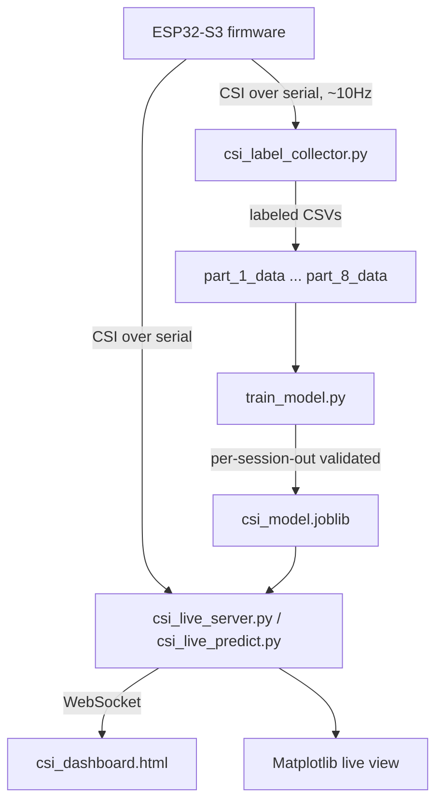

# CSI Motion Detection

Device-free motion detection using Wi-Fi Channel State Information (CSI) on a
single ESP32-S3 — no camera, no wearable. A person moving through a room
disturbs the multipath propagation between the ESP32 and the router in a way
an empty room doesn't, and CSI (which every Wi-Fi receiver already computes
internally to decode data) captures that disturbance as a side effect.

**Current state**: Random Forest classifier, 8 labeled recording sessions,
**95.54% leave-one-session-out accuracy**, with a live desktop tool and a
browser dashboard for real-time monitoring.

---

## How it works



1. **Firmware** (`firmware/`) pings the router ~10 times/second to keep a
   steady stream of CSI updates, and streams parsed frames over serial.
2. **`csi_label_collector.py`** auto-cycles a labeling protocol: countdown to
   leave the room → record EMPTY → wait for you to return → record MOVING →
   repeat. Solves the problem that you must be absent to record "empty" and
   present to record "moving."
3. **`train_model.py`** turns labeled CSVs into a validated Random Forest,
   using **leave-one-session-out** cross-validation — every session is held
   out and scored on a model that never trained on it, which is what makes
   the accuracy numbers below honest rather than optimistic.
4. **`csi_live_server.py`** (+ `csi_dashboard.html`) or **`csi_live_predict.py`**
   run the trained model against the live serial stream in real time.

---

## Results

| Check | Result |
|---|---|
| Leave-one-session-out accuracy (8 sessions) | **95.54%** |
| Best of 6 compared model families (RF, Gradient Boosting, Logistic Regression, SVM×2, KNN) | Random Forest wins outright, lowest variance too |
| True held-out session tests (trained on all others, scored once on a session never touched) | 91-99% across 4 independently tested sessions |
| Live reaction window | 0.75s (tuned — the best accuracy/speed tradeoff of 4 tested window sizes) |

Every one of those numbers came from actually running the scripts in this
repo, not from hand-picking a good run — see
[`docs/PROJECT_HISTORY.md`](docs/PROJECT_HISTORY.md) for the full,
warts-and-all account of what was tried, what failed, and why.

---

## What this project actually learned (the interesting part)

This project surfaced several real, diagnosable failures along the way —
documented in detail in [`docs/PROJECT_HISTORY.md`](docs/PROJECT_HISTORY.md)
because the diagnostic process is the most reusable part of the work:

- **A single bad "empty" recording can silently wreck a session** — CSI is
  sensitive enough to register a person lingering near a doorway as
  disturbance. Fixed with an explicit leave-the-room countdown protocol.
- **A single calibration snapshot goes stale within minutes** — turning on
  an AC mid-session, or slow thermal drift, can make a genuinely empty room
  start reading as "moving." Fixed by recalibrating at every empty block
  during training, and periodically during live deployment (see
  `RollingCalibrator` in `csi_common.py`).
- **Dead subcarriers can silently dominate aggregate features** — ~20 of 128
  subcarriers are structurally zero (OFDM guard bands); a feature that hunts
  for "the most disturbed subcarrier" can get hijacked by noise on a dead
  one, producing ratios of 10,000+ from nothing. Fixed with a variance floor.
- **Absolute features don't transfer across rooms** — a model can end up
  keying on "subcarrier index 43" only because that's where *this room's*
  multipath happened to be sensitive. Added order-invariant features
  (max/percentile across the whole band) that don't care which index fires.

---

## Project structure

```
firmware/                  ESP-IDF project for the ESP32-S3 sensor node
  main/csi_node.c             CSI capture, Wi-Fi ping trigger, UART output
  main/wifi_secrets.h.example  Copy to wifi_secrets.h and fill in your network

csi_label_collector.py     Auto-cycling data collector (leave/empty/moving protocol)
csi_live_monitor.py        Live waterfall + motion-energy verification tool

csi_common.py              Shared parsing, feature extraction, calibration, smoothing
                            (single source of truth - training and live inference
                            both import from here, so they can't silently diverge)
train_model.py              Trains + leave-one-session-out validates the model
evaluate_holdout.py         True held-out evaluation on a named session
analyze_model.py            Dumps fold accuracy / feature importance / etc. as JSON
compare_models.py           Compares 6 ML model families under identical validation

csi_live_predict.py         Matplotlib desktop live inference tool
csi_live_server.py          WebSocket backend for the browser dashboard
csi_dashboard.html          Browser dashboard: waterfall, motion energy, live status

part_1_data/ .. part_8_data/  Labeled recording sessions (see docs/PROJECT_HISTORY.md
                               section "Recording sessions in detail" for what each one is)
csi_model.joblib             The trained, deployed model

report/csi_report.tex        LaTeX writeup (for Overleaf)
docs/PROJECT_HISTORY.md      Full project history - every decision and why
```

---

## Getting started

### 1. Firmware

Requires [ESP-IDF](https://docs.espressif.com/projects/esp-idf/en/stable/esp32/get-started/).

```
cd firmware
cp main/wifi_secrets.h.example main/wifi_secrets.h
# edit main/wifi_secrets.h with your Wi-Fi SSID/password and router IP
idf.py set-target esp32s3
idf.py -p COM9 flash monitor
```

### 2. Python environment

```
python -m pip install -r requirements.txt
```

### 3. Record data

```
python csi_label_collector.py -p COM9 -b 115200 --subcarriers 128 --rssi-field --output-dir my_session_data
```
Leave the room when it counts down, press `m` when you're back and ready to move.

### 4. Train

```
python train_model.py --sessions part_1_data part_2_data ... my_session_data
```

### 5. Run it live

Desktop view:
```
python csi_live_predict.py -p COM9 -b 115200
```

Or the browser dashboard:
```
python csi_live_server.py -p COM9 -b 115200
# then open csi_dashboard.html in any browser
```

Only one program can hold the serial port at a time — close the IDF monitor
or the collector before running a live inference tool.

---

## Known limitations

- **Single room only.** The model has only ever been trained on one room.
  Cross-room generalization is an open, actively-being-tested question — see
  `docs/PROJECT_HISTORY.md` for the current status.
- **Off-axis blind spot.** Movement more than ~1m off the direct line between
  the ESP32 and the router is detected much more weakly — this is physics
  (single-link CSI sensitivity is strongest near that direct path), not a
  bug. Fixable by repositioning the hardware, or by adding a second node.
- **One person, one movement style.** All training data so far is one
  person's walking. Not yet tested against a different person or movement
  type.
- **Not true position/localization.** This detects *whether* someone is
  moving, not *where*. Real position tracking needs multiple antennas or
  multiple receiver nodes, which this single-ESP32 setup doesn't have.

---

## License

MIT — see [LICENSE](LICENSE).