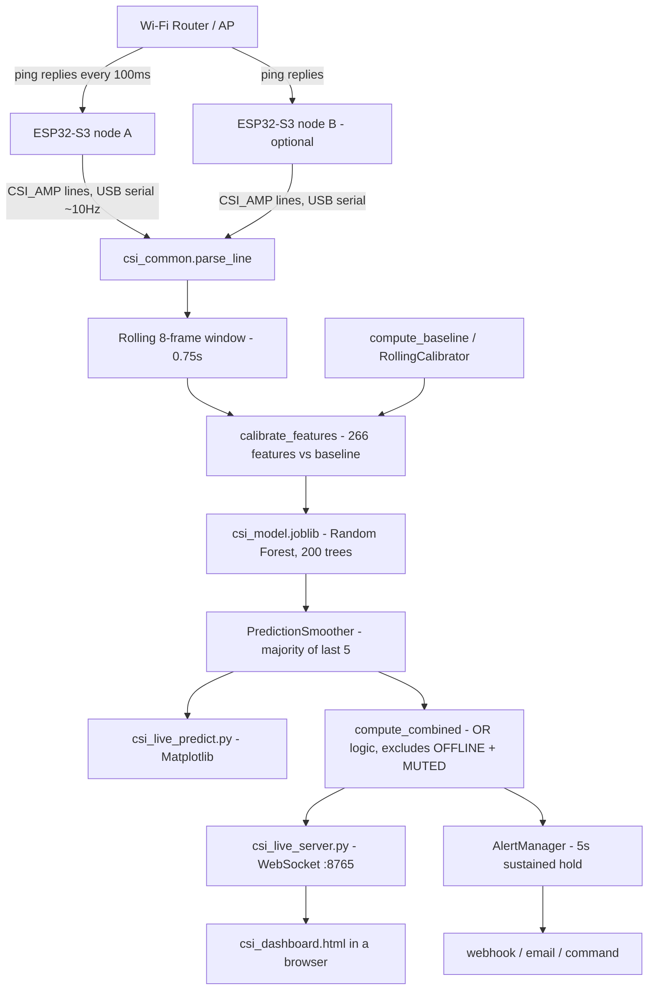
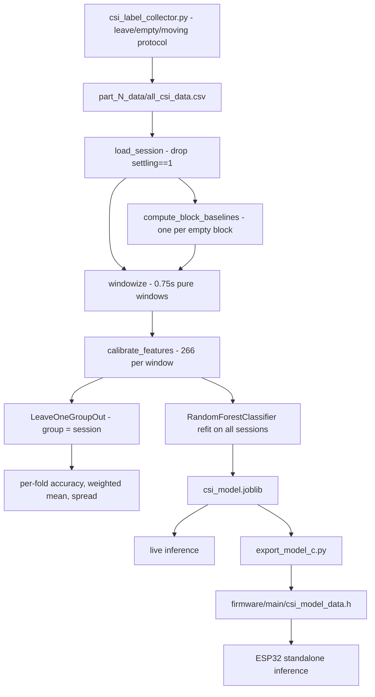
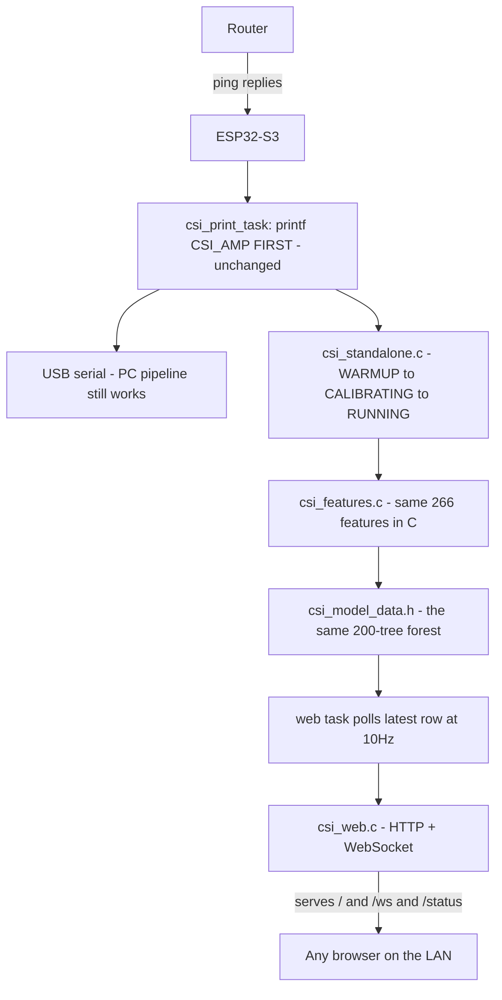

# CSI Motion Detection

**Device-free motion detection using Wi-Fi Channel State Information (CSI) on one or two ESP32-S3 boards.** No camera, no wearable, no sensor on the person. A person moving through a room disturbs the radio waves travelling between an ESP32 and a Wi-Fi router, and the ESP32 can measure that disturbance.

The system answers one question in real time: **is the room empty, or is someone moving in it?**

```
┌─────────────┐   Wi-Fi    ┌──────────┐
│  ESP32-S3   │◄──────────►│  Router  │     A person walking between them
│  (sensor)   │            │   (AP)   │     changes the radio reflections.
└──────┬──────┘            └──────────┘
       │ USB serial (CSI numbers, ~10 per second)
       ▼
┌─────────────┐
│  Your PC    │  Random Forest model  →  "EMPTY" or "MOVING"
└─────────────┘
```

**Measured accuracy: 94.25%** leave-one-session-out across 10 recording sessions in 2 rooms. That number is reproducible by running `python train_model.py` in this repo — see [Results](#results) for what it does and does not mean.

> [!IMPORTANT]
> This is a **research/hobby project**, not a security product. Read [Limitations](#limitations) before relying on it for anything. It has been trained on exactly **one person's** movement.

---

## Table of contents

| | |
|---|---|
| **Getting started** | [Quick Start](#quick-start) · [Hardware](#hardware-requirements) · [Software prerequisites](#software-prerequisites) · [Installation](#installation-from-scratch) |
| **The ESP32** | [Firmware setup](#esp32-firmware-setup) · [Wi-Fi configuration](#wi-fi-configuration) · [Verify the board](#verify-the-esp32-before-running-python) · [Serial port rules](#serial-port-rules-read-this) |
| **Using it** | [Data collection](#data-collection) · [Datasets](#included-datasets) · [Training](#training-the-model) · [Evaluation](#model-evaluation) · [Live detection](#running-live-motion-detection) |
| **Going further** | [Two nodes](#two-esp32-nodes) · [Standalone mode](#standalone-mode-no-pc-at-all) · [Alerting](#alerting) · [Diagnostics](#diagnostics) |
| **Reference** | [Architecture](#architecture) · [Project structure](#project-structure) · [Results](#results) · [Limitations](#limitations) · [Workflows](#common-workflows) · [Commands](#command-reference) · [FAQ](#beginner-faq) |
| **Help** | [Troubleshooting](#troubleshooting) · [Calibration & environment](#calibration-and-environmental-considerations) · [Placement](#physical-placement-guide) · [Security & privacy](#security-and-privacy) |

---

## Concepts you need first

If you already know what CSI is, skip to [Quick Start](#quick-start).

**What is CSI?** Every Wi-Fi receiver has to figure out how the radio channel distorted the signal in order to decode it. Wi-Fi splits its channel into many narrow **subcarriers** (parallel frequency slices), and the receiver estimates the amplitude and phase change on each one. That table of per-subcarrier estimates is the **Channel State Information**. It is computed as a normal part of receiving Wi-Fi; this project just asks the ESP32 to report it instead of discarding it.

**Why does movement show up in it?** Radio waves reach the receiver by many paths at once — straight there, plus bounces off walls, floor, furniture, and people. This is **multipath**. Those copies add up, and the sum is different at every frequency, which is why the subcarriers do not all look alike. A human body is mostly water and reflects/absorbs 2.4 GHz radio well, so a person moving through the room continuously changes the path lengths and therefore changes the CSI. An empty, still room produces a nearly constant CSI pattern; a person moving makes it fluctuate.

**What the firmware does.** Joins your Wi-Fi, pings the router every 100 ms to guarantee a steady stream of received packets (*no packets, no CSI*), converts each frame's raw I/Q pairs to amplitudes with `sqrt(imag² + real²)`, and prints one line per frame over USB serial at ~10 Hz. **Phase is discarded** at this point — this project is amplitude-only.

**What the PC does.** Reads those lines, groups frames into short **windows** (0.75 s), turns each window into 266 numbers (**features**), and asks a trained model whether that looks empty or moving.

**What "calibration" means.** Raw CSI values mean nothing on their own — they encode "what this room looks like right now" as much as "is someone here". So the system first records ~10 seconds of a **confirmed empty** room and stores it as a **baseline**. Every later window is described *relative to that baseline* (how much did the mean shift, how much did the spread grow). This is why every tool tells you to **leave the room** when it starts.

**What "empty" and "moving" mean.** These are the only two labels. `0` = EMPTY (nobody in the room). `2` = MOVING (a person present and moving). Label `1` ("still person") exists in the firmware but **is not trained or used** — a motionless person is not distinguished from an empty room by this system.

**What a "session" is.** One continuous recording made in one sitting, alternating empty and moving blocks, saved into its own folder. Sessions matter because they are the unit of validation — see [Training](#training-the-model).

**Why a Random Forest?** It was compared against 5 other model families on identical data and validation (`compare_models.py`) and won outright, with the lowest variance across sessions. It also needs no feature scaling, tolerates 266 features against ~3300 samples without collapsing, and is small and fast enough to run on the ESP32 itself.

---

## Quick Start

There are two paths. Pick one.

### Path A — Fastest: try the existing trained model

Use this if you just want to see it work. You still need an ESP32-S3 and a Wi-Fi network, because the input is live radio.

> **Reality check:** the included model was trained in the author's two rooms with the author's hardware. It will likely still work in your room, but accuracy in a *new* room is genuinely unpredictable — the honest cross-room number measured here is **82.5%** (see [Results](#results)). If it performs badly, that is expected, and Path B is the fix.

```bash
# 1. Get the code
git clone https://github.com/IALR/csi-motion-detection.git
cd csi-motion-detection

# 2. Python environment
python -m venv .venv
# Windows PowerShell:      .\.venv\Scripts\Activate.ps1
# Windows CMD:             .\.venv\Scripts\activate.bat
# Linux/macOS:             source .venv/bin/activate
python -m pip install -r requirements.txt

# 3. Configure Wi-Fi for the board
cd firmware
cp main/wifi_secrets.h.example main/wifi_secrets.h
#    then edit main/wifi_secrets.h — see "Wi-Fi configuration" below

# 4. Build and flash (needs ESP-IDF installed and its environment sourced)
idf.py set-target esp32s3
idf.py -p <YOUR_PORT> flash monitor
#    watch for "CSI enabled" and CSI_AMP,... lines, then press Ctrl-] to quit
cd ..

# 5. Run live detection, and LEAVE THE ROOM for the first 10 seconds
python csi_live_server.py -p <YOUR_PORT> -b 115200

# 6. Open csi_dashboard.html in a browser (double-click it / File > Open)
```

Replace `<YOUR_PORT>` with your actual serial port: `COM9` on Windows, `/dev/ttyUSB0` or `/dev/ttyACM0` on Linux, `/dev/cu.usbserial-*` on macOS. See [Finding your serial port](#finding-your-serial-port).

### Path B — Full workflow: your own data and your own model

Do this if Path A works poorly in your room, which is the expected outcome in a room unlike the author's. **Recommended:** record at least 3–4 sessions, across more than one day.

```bash
# Steps 1-4 from Path A first (code, Python, Wi-Fi, firmware).

# 5. Record a session. Note -b 115200 is REQUIRED (see the warning below).
python csi_label_collector.py -p <YOUR_PORT> -b 115200 \
    --subcarriers 128 --rssi-field --output-dir my_session_1_data
#    Follow the on-screen protocol: leave the room, come back, press 'm', repeat.
#    Press 'q' to stop.

# 6. Repeat step 5 several times, on different days, into my_session_2_data, etc.

# 7. Train on your sessions (add the bundled ones too if you like)
python train_model.py --sessions my_session_1_data my_session_2_data my_session_3_data
#    This OVERWRITES csi_model.joblib. Back it up first if you want to keep it.

# 8. Run live detection as in Path A step 5.
```

> [!WARNING]
> **Always pass `-b 115200` to `csi_label_collector.py`.** Its built-in default is `921600`, which does **not** match the firmware's console baud rate (115200, set by `CONFIG_ESP_CONSOLE_UART_BAUDRATE`). Omitting the flag gives you garbage or silence. The other tools already default to 115200 correctly. This is a known inconsistency in the repo.

---

## Hardware requirements

### The board

| Item | Requirement | Verified how |
|---|---|---|
| Chip | **ESP32-S3** | `CONFIG_IDF_TARGET="esp32s3"` in `firmware/sdkconfig`; `idf.py set-target esp32s3` |
| Flash | **16 MB** as committed | `CONFIG_ESPTOOLPY_FLASHSIZE_16MB=y` in `firmware/sdkconfig.defaults` |
| Partition layout | 4 MB app + 1 MB storage | `firmware/partitions.csv` |
| Firmware size | ~1.27 MB, ~68% of the app partition free | Recorded in `docs/PROJECT_HISTORY.md` §27 |
| Boards needed | **1 is enough.** 2 improves coverage | `--port-b` in `csi_live_server.py` |

**No specific board model is endorsed by this repository.** It contains no board-specific pin configuration — nothing beyond "an ESP32-S3 with enough flash". The board this project was developed on has 16 MB flash and 8 MB PSRAM (PSRAM is *not* required; the firmware's buffers are ~107 KB of internal SRAM).

**What actually matters technically:**
- It must be an **ESP32-S3** (the ESP-IDF target is set to `esp32s3`; other ESP32 variants would need retargeting and are untested here).
- Flash must fit the app. The committed config assumes 16 MB. **If your board has less** (e.g. 8 MB), you must edit `firmware/sdkconfig.defaults` (`CONFIG_ESPTOOLPY_FLASHSIZE_*`) and possibly `firmware/partitions.csv`. 4 MB app + 1 MB storage + bootloader needs roughly 5.2 MB, so an 8 MB part can work — **this has not been tested here.**
- A working antenna. Boards with a u.FL connector may ship with the trace antenna disconnected; that produces weak reception, which `diagnose_nodes.py` can identify.

> [!NOTE]
> **Recommended:** buy two identical boards if you plan to use two nodes. The project measured two boards at the *same spot* reading RSSI −47.0 vs −59.3 dBm — a 12 dB difference in hardware sensitivity that changes how each one behaves.

### Everything else

| Item | Requirement | Notes |
|---|---|---|
| **USB cable** | Data-capable micro-USB or USB-C, matching your board | Charge-only cables are a very common cause of "port not found" |
| **Computer** | Any machine that runs Python and ESP-IDF | Developed on Windows 11. Nothing in the Python code is Windows-specific; serial port *names* differ per OS |
| **Wi-Fi router / AP** | Must be reachable by IP and respond to ping | The firmware pings it every 100 ms to generate traffic |
| **Channel width** | **20 MHz** | 20 MHz → 128 subcarriers; 40 MHz → 192. The model requires 128. The firmware now pins its own link to 20 MHz — see [Wi-Fi configuration](#wi-fi-configuration) |
| **Internet** | **Not required** | Only local ping traffic between board and router is needed |
| **Ethernet** | Not required, not used | The PC talks to the board over **USB**, not the network |

**Does the PC need Wi-Fi?** No. The PC connects to the ESP32 by **USB serial**. The PC does not need to be on the same network as the board — *except* in [standalone mode](#standalone-mode-no-pc-at-all), where you browse to the board's IP, and there you do.

---

## Software prerequisites

| Tool | Needed for | Why |
|---|---|---|
| **Git** | Cloning | Standard |
| **Python 3** | Everything on the PC side | All collection, training, evaluation and live tools |
| **ESP-IDF** | Building/flashing firmware | The firmware is an ESP-IDF project; there is no pre-built binary in this repo |
| **A web browser** | The dashboard only | `csi_dashboard.html` is plain HTML/JS, no build step, no external dependencies |
| **USB serial driver** | Windows, sometimes | Boards use CP210x or CH340 USB-UART bridges; Windows may need the vendor driver |

### Python version

**Not pinned anywhere in the repository** — there is no `setup.py`, `pyproject.toml`, or `python_requires`. Verified working on **Python 3.14.5**. The dependency floors (`numpy>=2.0`, `pandas>=2.0`, `scikit-learn>=1.5`) imply a reasonably modern Python; 3.10+ is a safe assumption but is a recommendation, not a repository fact.

### ESP-IDF version

**v6.0.2** — read from `firmware/build/project_description.json` (`"git_revision": "v6.0.2"`). Install per [Espressif's guide](https://docs.espressif.com/projects/esp-idf/en/stable/esp32s3/get-started/).

The firmware needs `CONFIG_HTTPD_WS_SUPPORT=y` (WebSocket support in `esp_http_server`, off by default). This is already set in `firmware/sdkconfig.defaults`, so you get it automatically.

### Python packages

From `requirements.txt` — minimum versions are pinned deliberately, and the file explains why (an unpinned `reportlab` once broke an import):

| Package | Min | Used by |
|---|---|---|
| `pyserial` | 3.5 | Every tool that opens a serial port |
| `numpy` | 2.0 | All feature math |
| `pandas` | 2.0 | Reading session CSVs |
| `scikit-learn` | 1.5 | The Random Forest |
| `joblib` | 1.4 | Saving/loading `csi_model.joblib` |
| `websockets` | 12.0 | `csi_live_server.py` only |
| `matplotlib` | 3.8 | `csi_live_predict.py`, `csi_live_monitor.py`, PDF reports |
| `reportlab` | 4.0 | `full_model_report.py` only |
| `pytest`, `pytest-asyncio` | 8.0, 0.23 | Tests only |

> [!IMPORTANT]
> A pickled `csi_model.joblib` is only reliably loadable under the scikit-learn major version that wrote it. The bundled model was created with **scikit-learn 1.9.0**. If loading fails with a version warning or error, **retrain**: `python train_model.py`.

### Finding your serial port

| OS | Typical name | How to find it |
|---|---|---|
| **Windows** | `COM3`, `COM9` | Device Manager → *Ports (COM & LPT)*, or `mode` in CMD |
| **Linux** | `/dev/ttyUSB0` (CP210x/CH340), `/dev/ttyACM0` (native USB) | `ls /dev/ttyUSB* /dev/ttyACM*`, or `dmesg \| tail` after plugging in |
| **macOS** | `/dev/cu.usbserial-XXXX`, `/dev/cu.SLAB_USBtoUART` | `ls /dev/cu.*` |

Every `-p` / `--port` / `--port-b` argument in this README takes one of these. **Substitute your own** — `COM9` appears as the default throughout this project only because that is what the author's board enumerated as.

**Linux permissions:** if you get `Permission denied: '/dev/ttyUSB0'`, add yourself to the `dialout` group (`sudo usermod -aG dialout $USER`) and log out and back in.

---

## Installation from scratch

```bash
git clone https://github.com/IALR/csi-motion-detection.git
cd csi-motion-detection
```

Create a virtual environment. This is a **recommendation**, not a repository requirement — nothing in the code assumes one — but it keeps these pinned versions away from your system Python.

```bash
python -m venv .venv
```

Activate it:

| Shell | Command |
|---|---|
| Windows PowerShell | `.\.venv\Scripts\Activate.ps1` |
| Windows CMD | `.\.venv\Scripts\activate.bat` |
| Linux / macOS | `source .venv/bin/activate` |

> On Windows PowerShell you may hit `running scripts is disabled on this system`. Fix with `Set-ExecutionPolicy -Scope CurrentUser RemoteSigned`, then activate again.

Install dependencies:

```bash
python -m pip install -r requirements.txt
```

**Verify the installation** without any hardware attached:

```bash
python -m pytest tests/
```

Expected: `72 passed`. This exercises parsing, calibration, smoothing, node-combination logic and alerting — all without a board. If this passes, your Python side is correctly installed.

You can also confirm the bundled model loads:

```bash
python -c "import joblib; b=joblib.load('csi_model.joblib'); print(len(b['amp_columns']), 'subcarriers,', b['window_seconds'], 's window')"
# expected: 128 subcarriers, 0.75 s window
```

**Working directory:** every command in this README runs from the **repository root** (except `idf.py` commands, which run from `firmware/`). The scripts resolve session folders and `csi_model.joblib` relative to the current directory.

---

## ESP32 firmware setup

### 1. Enter the firmware directory

```bash
cd firmware
```

### 2. Create your secrets file

```bash
cp main/wifi_secrets.h.example main/wifi_secrets.h    # Linux/macOS
copy main\wifi_secrets.h.example main\wifi_secrets.h  # Windows CMD
```

Edit `main/wifi_secrets.h`. The template is exactly three defines:

```c
#pragma once

#define WIFI_SSID "YOUR_WIFI_SSID"
#define WIFI_PASS "YOUR_WIFI_PASSWORD"
#define ROUTER_IP "192.168.1.1"   // your router / AP's LAN IP
```

| Value | What it is | How to find it |
|---|---|---|
| `WIFI_SSID` | Your network name, exactly as broadcast | Your device's Wi-Fi list. Case-sensitive |
| `WIFI_PASS` | The Wi-Fi password | — |
| `ROUTER_IP` | **Fallback only** ping target | Windows: `ipconfig` → *Default Gateway*. Linux/macOS: `ip route \| grep default` or `netstat -nr \| grep default` |

> [!NOTE]
> **`ROUTER_IP` is only a fallback.** The firmware prefers the gateway address from its own DHCP lease (`ip_info.gw`), which is correct by construction. A hardcoded address silently broke this project three times when the network changed subnet. If you are unsure, leaving the template value is usually harmless — the log line tells you which target is actually in use.

> [!CAUTION]
> `firmware/main/wifi_secrets.h` is in `.gitignore` and contains **real credentials**. Never remove it from `.gitignore` and never commit it. Only the `.example` template belongs in the repo.

### 3. Set up the ESP-IDF environment

Each new terminal needs the IDF environment exported:

| OS | Command |
|---|---|
| Windows | Use the *ESP-IDF PowerShell/CMD* shortcut the installer created, or run `%IDF_PATH%\export.ps1` |
| Linux / macOS | `. $HOME/esp/esp-idf/export.sh` |

Confirm with `idf.py --version`.

### 4. Select the target, build, and flash

```bash
idf.py set-target esp32s3
idf.py build
idf.py -p <YOUR_PORT> flash monitor
```

`flash monitor` flashes then immediately opens the serial monitor. **Exit the monitor with `Ctrl-]`.**

### 5. What a successful boot looks like

In order, you should see:

```
csi_selftest: ... PASS  (on-device model matches the PC)
csi_node: WiFi init done, connecting...
csi_node: link pinned to 20MHz (keeps CSI at 128 subcarriers)
csi_node: Got IP: 192.168.x.x
csi_node: gateway 192.168.x.1 (CSI ping target)
csi_node: >>> open http://192.168.x.x/ in a browser for the dashboard <<<
csi_node: AP BSSID xx:xx:..., ch 6
csi_node: Ping started (100 ms interval)
csi_node: CSI enabled
CSI_AMP,123456789,0,128,-47,31,29,0,0,33,...
CSI_AMP,123456889,0,128,-47,30,30,0,0,32,...
```

The `CSI_AMP` lines are the data. There should be **about 10 per second**.

The line format is:

```
CSI_AMP,<timestamp_us>,<label>,<num_subcarriers>,<rssi>,<amp0>,<amp1>,...
```

### 6. What errors mean

| What you see | What it means |
|---|---|
| `Self-test FAILED` | On-device inference is untrustworthy. Serial streaming still works, so the PC pipeline is unaffected. Regenerate headers with `export_model_c.py` / `export_test_vectors.py` and rebuild |
| Stuck at `connecting...`, repeating `Disconnected, retrying...` | Wrong SSID or password in `wifi_secrets.h`. Check case and typos |
| `Got IP` and `CSI enabled` but **no `CSI_AMP` lines** | The ping target is unreachable, so no packets arrive, so no CSI is produced. Check that the router responds to ping and that client isolation / AP isolation is off |
| `could not pin 20MHz: ...` | The bandwidth pin failed. The AP may negotiate 40 MHz, giving 192 subcarriers and disabling detection |
| `num_subcarriers` field reads `192` instead of `128` | The link is at 40 MHz. See [Wi-Fi configuration](#wi-fi-configuration) |
| `CSI frames dropped (queue full): N` | The UART cannot keep up. Informational unless N climbs steadily |

### The path from board to prediction

```
ESP32-S3  ──Wi-Fi──►  Router/AP  ──ping replies──►  ESP32-S3
                                                        │
                                        CSI computed while receiving
                                                        │
                                              amplitudes over USB serial
                                                        │
                                                        ▼
                                          Python: parse → window → features
                                                        │
                                                        ▼
                                            Random Forest → EMPTY / MOVING
```

---

## Wi-Fi configuration

**Why the board needs a router at all.** CSI only exists when a packet is *received*. An idle ESP32 receives almost nothing, so it would produce almost no CSI. The firmware manufactures a steady stream by **pinging the router every 100 ms**, and each reply produces one CSI frame — hence the ~10 Hz rate.

**What the router address is used for.** Purely as that ping target. Nothing is uploaded anywhere.

**Is Internet access required?** **No.** The board needs to reach the router, nothing beyond it. An offline access point works fine.

**Must the ESP32 stay connected?** Yes. On disconnect the firmware logs `Disconnected, retrying...` and calls `esp_wifi_connect()` in a loop. While disconnected there are no ping replies, so **no CSI is produced**. On the PC side, `csi_live_server.py` marks a node `OFFLINE` after **20 seconds** without frames (`NODE_STALE_SECONDS`), which removes it from the combined vote rather than freezing its last state.

### Channel width — the one setting that matters

**The number of CSI subcarriers is set by the channel width: 20 MHz → 128, 40 MHz → 192.** The model is trained on 128. A 40 MHz link makes every feature vector the wrong shape and detection stops.

This broke the project **three separate times**. The fix is now in the firmware, at the right end:

```c
esp_wifi_set_bandwidth(WIFI_IF_STA, WIFI_BW20);
```

The station advertises 20 MHz only, so the AP cannot pull the link up to 40 MHz whatever it decides to do. **This is scoped to this board's own link** — it changes nothing about your router or other devices, and it works even on a phone hotspot that offers no width setting.

If it still happens, the system now degrades gracefully rather than silently:
- `csi_live_server.py` disables predictions **for that node only**, keeps it streaming, and shows a dashboard warning. It re-latches automatically after 20 sustained frames at the new width.
- The board's own dashboard reports the mismatch too.

**Other Wi-Fi notes:**
- Only CSI from your own AP is kept — frames are filtered by the AP's BSSID.
- A **congested 2.4 GHz channel raises the noise floor**, which is the single biggest environmental factor in accuracy. See [Calibration and environment](#calibration-and-environmental-considerations).
- 5 GHz vs 2.4 GHz is not configured or tested by this project.

---

## Verify the ESP32 before running Python

Before involving Python at all, confirm the board is producing data.

```bash
cd firmware
idf.py -p <YOUR_PORT> monitor
```

**Good** — a steady stream, roughly 10 lines per second:

```
CSI_AMP,15234567,0,128,-47,31,29,0,0,33,35,34,...
CSI_AMP,15334512,0,128,-47,30,30,0,0,32,36,33,...
```

Check three things:
1. **Lines are appearing continuously**, not in one burst then silence.
2. **The 4th field is `128`.** If it is `192`, your link is at 40 MHz.
3. **The 5th field (RSSI) is plausible** — typically −30 to −70. Much below −75 means weak reception.

**Bad** — boot messages but no `CSI_AMP` lines at all: the ping target is unreachable. **Bad** — nothing at all: wrong port, bad cable, or unpowered board.

**Exit the monitor with `Ctrl-]`.** Not Ctrl-C.

### Serial port rules — read this

> [!IMPORTANT]
> **Only one program can hold a serial port at a time.** This is an OS-level rule, not a project limitation, and it is by far the most common problem people hit.

These all need exclusive access to the same port:

- `idf.py monitor`
- `idf.py flash`
- `csi_label_collector.py`
- `csi_live_predict.py`
- `csi_live_server.py`
- `csi_live_monitor.py`
- `diagnose_nodes.py`

```
idf.py monitor still running
            +
python csi_live_server.py -p COM9
            =
"Could not open COM9: Access is denied"
```

**Fix:** exit the monitor with `Ctrl-]`, then start the Python tool. On Windows also close any Arduino IDE serial monitor, PuTTY, or VS Code serial terminal.

#### The "port opens but zero bytes" trap

There is a second, sneakier version of this. ESP32 dev boards wire the USB bridge's **RTS to EN (reset)** and **DTR to GPIO0 (boot select)**. Exiting `idf.py monitor` can leave RTS asserted, which **holds the chip in reset**. The port then opens perfectly and the board sends nothing — indistinguishable from a wrong port.

Three tools now pulse those lines on open and are immune:

| Tool | Pulses DTR/RTS on open? |
|---|---|
| `csi_live_server.py` | ✅ Yes |
| `csi_label_collector.py` | ✅ Yes |
| `diagnose_nodes.py` | ✅ Yes |
| `csi_live_predict.py` | ❌ **No** |
| `csi_live_monitor.py` | ❌ **No** |

If `csi_live_predict.py` sits at "waiting for data" forever, **unplug and replug the board**, or run `csi_live_server.py` once to reset it. (This is a known inconsistency in the repo.)

---

## Data collection

Use `csi_label_collector.py` to record labeled training data.

**The core problem it solves:** you must be *absent* to record "empty" and *present* to record "moving". So EMPTY blocks are fully automatic with a countdown to leave, and MOVING blocks are started by a keypress once you are back.

### The protocol

```
START
  │
  ├─► LEAVE countdown (5 s)      frames saved with settling=1, dropped at training
  │
  ├─► RECORD EMPTY (60 s)        you are OUT of the room
  │
  ├─► WAIT (indefinite)          you walk back in; nothing is recorded
  │       press 'm'
  │
  ├─► RECORD MOVING (60 s)       you move around the room
  │
  └─► back to LEAVE countdown … repeat until you press 'q'
```

### What you should physically do

| Stage | What you do |
|---|---|
| **LEAVE countdown** | Walk out of the room immediately and **close the door**. 5 seconds is short |
| **EMPTY (60 s)** | Stay out. Genuinely out — do not stand in the doorway. CSI is sensitive enough to register a person lingering near the door, and one contaminated empty block can wreck the session |
| **WAIT** | Walk back in. Take your time; nothing is being recorded |
| **MOVING (60 s)** | Move around the room **normally and continuously**. Walk about, cover different parts of the room. Do not stand still — "still person" is not a class this system knows |
| **`q`** | Stops and saves |

### Running it

```bash
python csi_label_collector.py -p <YOUR_PORT> -b 115200 \
    --subcarriers 128 --rssi-field --output-dir my_session_1_data
```

> [!WARNING]
> `-b 115200` is **required** — the script's default of `921600` does not match the firmware. `--rssi-field` is **required** with this firmware (it emits RSSI before the amplitudes). Without it, RSSI gets misread as the first amplitude.

### Arguments

| Argument | Default | Meaning |
|---|---|---|
| `-p`, `--port` | `COM9` | Node A's serial port |
| `--port-b` | *none* | Second board's port. Both record the same protocol simultaneously, into `node_a/` and `node_b/` subfolders. Needed for zone work |
| `-b`, `--baud` | **`921600`** | ⚠️ **Pass `115200`** |
| `-o`, `--output-dir` | `csi_dataset_<timestamp>` | Session folder |
| `--subcarriers` | *none* | Expected count; mismatched frames are dropped. Use `128` |
| `--rssi-field` | off | Firmware emits RSSI before amplitudes. **Use it** |
| `--leave-seconds` | `5.0` | Countdown length |
| `--block-seconds` | `60.0` | Length of each EMPTY and MOVING block |

### Keys while running

| Key | Action |
|---|---|
| `m` | Start a plain MOVING block |
| `1` / `2` | Start a MOVING block tagged **zone 1 / 2** (experimental — see [Zone detection](#zone-detection-experimental-and-unproven)) |
| `q` | Stop and save |

### What it produces

```
my_session_1_data/
├── all_csi_data.csv    ← every frame, both labels. This is what training reads
├── label_0.csv         ← empty frames only (convenience copy)
└── label_2.csv         ← moving frames only (convenience copy)
```

With `--port-b`:

```
my_session_1_data/
├── node_a/    (all_csi_data.csv, label_0.csv, label_2.csv)
└── node_b/    (all_csi_data.csv, label_0.csv, label_2.csv)
```

CSV columns: `session_id, host_unix_us, timestamp_us, label, zone, esp_label, settling, rssi, num_subcarriers, amp_0 … amp_127`.

> [!NOTE]
> The `zone` column is newer than the bundled sessions, which do not have it. `train_model.py` never reads it, so old and new sessions mix freely.

### How much to record, and why more than one session

**Recommended: at least 3–4 sessions, on at least 2 different days.**

This is not padding. Validation here is **leave-one-session-out** — a model is scored on a session it has never seen. With one session you cannot do that at all, and a model tested on data from the same recording will look far better than it is, because it can memorise that recording's specific multipath rather than learning what motion looks like. Recording on different days is what forces it to survive day-to-day drift.

The bundled sessions each hold ~2,400–4,800 usable frames (roughly 4–8 minutes of recording).

---

## Included datasets

Ten sessions ship with the repository. Every one is **128 subcarriers at 10 Hz**, and every one is **in the training set** of the deployed model.

| Folder | Frames | Empty / Moving | Room | What it is |
|---|---|---|---|---|
| `part_1_data/` | 1,276 | 676 / 600 | 1 | First original session |
| `part_2_data/` | 2,656 | 1,456 / 1,200 | 1 | Second original session |
| `part_3_data/` | 2,802 | 1,602 / 1,200 | 1 | Third original session |
| `part_4_data/` | 2,648 | 1,448 / 1,200 | 1 | The original "true held-out" session (98.33% when trained on 1–3 only) |
| `part_5_data/` | 2,637 | 1,437 / 1,200 | 1 | AC turned on mid-session — motivated per-block recalibration |
| `part_6_data/` | 2,605 | 1,405 / 1,200 | 1 | Continuous drift within the session; noisy |
| `part_7_data/` | 2,608 | 1,408 / 1,200 | 1 | Less vigorous movement; exposed a window-size artifact |
| `part_8_data/` | 2,619 | 1,419 / 1,200 | 1 | Deliberately "opened the window"; noisy |
| `room2_part_1_data/` | 5,019 | 2,618 / 2,401 | **2** | First session in a genuinely different room — the cross-room test (82.5% held out) |
| `room2_part_2_data/` | 3,767 | 1,967 / 1,800 | **2** | Second room-2 session, folded into training |

**Total: 28,637 frames ≈ 48 minutes of recording → 3,302 windows** (1,654 empty / 1,648 moving) at the deployed 0.75 s window.

> [!IMPORTANT]
> **There is no permanently held-out test set.** Every session is used for training in the final model. "Held out" numbers come from **rotating** which session is excluded (leave-one-session-out), or from `evaluate_holdout.py`, which trains a fresh model excluding whatever you name. Both are honest, but neither leaves a set of data the model has never influenced.

`docs/PROJECT_HISTORY.md` §17 ("Recording sessions in detail") documents each session's story, including sessions that were recorded and **discarded** (a contaminated empty block, a 192-subcarrier recording). Those were overwritten and are not on disk.

`csi_dataset_20260723_184612/` exists locally but is **gitignored** — a pre-fix legacy dataset with mixed subcarrier counts and known contamination. Do not train on it.

---

## Training the model

```bash
python train_model.py
```

**With no arguments this reproduces the deployed model exactly** — 10 sessions at a 0.75 s window. This is deliberate: the defaults used to be 4 sessions at 2.0 s (early-development values), so a bare run silently retrained on less than half the data and overwrote the good model with a weaker one.

> [!CAUTION]
> `train_model.py` **overwrites `csi_model.joblib`** by default. Back it up, or use `--model-out other.joblib`, if you want to keep the current one.

### What it does

1. **Reads** `<session>/all_csi_data.csv` for each session.
2. **Drops** `settling == 1` rows (the leave-the-room window).
3. **Calibrates per empty block.** Every time the recording re-enters an empty block, that block's first 10 s becomes a fresh baseline. A single session-wide baseline was tried and goes stale within minutes — real sessions show both sudden shifts (AC switching on) and slow thermal drift.
4. **Splits into windows** of 0.75 s (8 frames at 10 Hz), non-overlapping. A window is kept only if **all** its frames share one label; windows straddling a transition are dropped.
5. **Extracts 266 features** per window, all relative to the governing baseline.
6. **Validates** with leave-one-session-out, then refits on everything and saves.

### The 266 features

| Count | Feature | What it captures |
|---|---|---|
| 128 | `amp_N_mean_delta` | How far each subcarrier's mean amplitude moved from baseline |
| 128 | `amp_N_std_ratio` | How much each subcarrier's fluctuation grew vs baseline |
| 2 | `motion_energy_mean_ratio`, `motion_energy_std_ratio` | Frame-to-frame change across the whole band |
| 2 | `rssi_mean_delta`, `rssi_std_ratio` | Overall signal strength shift |
| 6 | `std_ratio_max`, `std_ratio_topK_mean`, `std_ratio_p90`, `std_ratio_frac_elevated`, `mean_delta_absmax`, `mean_delta_absmax_topK_mean` | **Order-invariant** summaries — "is *something* in the band disturbed", without caring *which* index |

The last six exist for cross-room transfer. Per-index features can key on "subcarrier 43" purely because that is where *this* room's multipath was sensitive; a different room puts it elsewhere.

### Leave-one-session-out, in plain terms

```
Fold 1:  test on part_1_data   ← train on the other 9
Fold 2:  test on part_2_data   ← train on the other 9
Fold 3:  test on part_3_data   ← train on the other 9
   ...
Fold 10: test on room2_part_2_data ← train on the other 9
```

**Why not just shuffle all the windows and split randomly?** Because consecutive windows from the same recording are extremely similar — same room, same furniture, same minute, same multipath. A random split puts near-duplicates on both sides, so the model can effectively memorise and score ~99%, telling you nothing about whether it works tomorrow. Holding out an entire *session* forces every test to be a recording the model has never seen. It is the difference between "can it recognise this recording" and "can it recognise motion".

### Arguments

| Argument | Default | Meaning |
|---|---|---|
| `--sessions` | the 10 bundled sessions | Session folders to use |
| `--window-seconds` | `0.75` | Window length. **Also the live reaction time** |
| `--calib-seconds` | `10.0` | Baseline length at each empty block |
| `--n-estimators` | `200` | Trees in the forest |
| `--max-depth` | `None` | Unlimited depth |
| `--model-out` | `csi_model.joblib` | Where to save |

### Examples

```bash
# Reproduce the deployed model
python train_model.py

# Your own sessions only
python train_model.py --sessions my_session_1_data my_session_2_data my_session_3_data

# Add yours to the bundled ones (best if your room resembles neither)
python train_model.py --sessions part_1_data part_2_data part_3_data part_4_data \
    part_5_data part_6_data part_7_data part_8_data \
    room2_part_1_data room2_part_2_data my_session_1_data

# Experiment safely, without touching the deployed model
python train_model.py --window-seconds 1.5 --model-out experiment.joblib
```

### Adding a new session

1. Record it into `my_new_session_data/` with the collector.
2. Add its folder name to `--sessions` alongside the others.
3. Run `train_model.py` and check the new fold's accuracy in the output.

**Optional but recommended:** to make it a permanent default, add it to `DEFAULT_SESSIONS` in [train_model.py:198](train_model.py#L198). Every analysis script imports that list, so they all stay consistent — a test (`test_default_sessions_all_exist_on_disk`) enforces that the names are real.

### Window size

`--window-seconds` is a direct **accuracy vs. reaction-time** trade. 0.75 s was chosen by comparing four sizes; it is the fastest that keeps accuracy high. Larger windows average over more frames and score slightly better but make the system slower to notice someone. Because the value is stored in the model bundle, the live tools automatically use whatever the model was trained with.

### Expected output

```
part_1_data: 1200 frames -> 150 windows (1 empty block(s), each recalibrated on its own first 10.0s)
    noise: rel=0.0249 [quiet]  (empty=0.83 moving=3.85 sep=4.66x amp=33.2)
...
Total windows: 3302  |  class counts: {0: 1654, 2: 1648}

--- Fold 1: held out part_1_data ---
Accuracy: 0.9600
...
======================================================================
Leave-one-session-out accuracy (per-window, weighted): 0.9425
  unweighted mean of folds:  0.9507  <- optimistic: small easy sessions count as much as big hard ones
  spread across sessions:    std=0.0386  worst=0.8467 (room2_part_1_data)
  per-fold: [0.96, 0.9867, 0.9869, 0.9567, 0.9533, 0.9428, 0.94, 0.95, 0.8467, 0.9844]
======================================================================
```

Watch the per-session `noise:` line. `sep=` below `1.15x` triggers `*** empty/moving barely differ` — that session's empty and moving states are nearly indistinguishable in aggregate energy, and it will likely score poorly.

---

## Model evaluation

Five analysis scripts. All import `DEFAULT_SESSIONS` and `DEFAULT_WINDOW_SECONDS` from `train_model.py`, so they all describe the **deployed** configuration by default. None of them overwrite `csi_model.joblib`.

### `evaluate_holdout.py` — "does it generalize to a new recording?"

Trains **one** model excluding the named session(s), scores it once on them. This is the honest single-shot generalization number.

```bash
python evaluate_holdout.py --test room2_part_1_data
python evaluate_holdout.py --train part_1_data part_2_data --test part_4_data
```

| Argument | Default | Meaning |
|---|---|---|
| `--test` | **required** | Session folder(s) to hold out and score |
| `--train` | all known sessions except `--test` | Training sessions |
| `--window-seconds` | `0.75` | |
| `--n-estimators` | `200` | |

**Output:** accuracy, a per-class `classification_report` (precision/recall/F1), and a confusion matrix.

**Use it when** you have recorded a new session and want to know whether the existing model handles it.

### `analyze_model.py` — the numbers, as JSON

```bash
python analyze_model.py                      # writes model_analysis.json
python analyze_model.py --out my_analysis.json
```

Re-runs the LOSO pipeline and dumps per-fold accuracy and confusion matrices, final-model feature importances, per-session class balance, and per-class motion-energy distributions. **Use it when** you want to chart or post-process results. (`model_analysis.json` is gitignored — it is regenerable.)

### `compare_models.py` — is a Random Forest the right choice?

```bash
python compare_models.py
```

Runs **six** model families through identical features and identical LOSO validation: Random Forest, Gradient Boosting, Logistic Regression, SVM (×2 kernels), and KNN. Scale-sensitive models get a `StandardScaler`. **Use it when** you are curious, or after substantially changing the features. The Random Forest won outright, including on variance across sessions.

### `model_evaluation.py` — a PDF health report

```bash
python model_evaluation.py                    # writes model_evaluation_report.pdf
python model_evaluation.py --out my_report.pdf
```

Multi-page PDF: confusion matrix, feature correlation matrix, two overfitting diagnostics, and a red/amber/green health summary, plus a text summary on stdout. **Use it when** you want something to show someone.

### `full_model_report.py` — the generic report generator

The only script that **requires** `--model`, and the only one that also accepts a generic CSV rather than this project's folder layout.

```bash
python full_model_report.py --model csi_model.joblib --sessions part_1_data part_2_data
python full_model_report.py --model csi_model.joblib --csv my_features.csv
```

| Argument | Default | Meaning |
|---|---|---|
| `--model` | **required** | Path to a `.joblib` bundle |
| `--csv` *or* `--sessions` | **one required** (mutually exclusive) | Data source |
| `--target-col` | `label` | With `--csv` |
| `--session-col` | `session` | With `--csv` |
| `--window-seconds` | `0.75` | Only used with `--sessions` |
| `--output-dir` | `report_output` | |
| `--report-name` | `report.pdf` | |

Produces ~20 figures and 16 metrics into `report_output/` (gitignored). **Use it when** you want the deepest analysis, or to evaluate a model on data outside this project's layout.

### Reading the metrics

| Metric | What it means here |
|---|---|
| **Accuracy** | Fraction of windows classified correctly. Meaningful because the classes are near-balanced (1,654 vs 1,648) |
| **Precision** (class 2) | Of the windows called MOVING, how many really were. Low precision = **false alarms** |
| **Recall** (class 2) | Of the windows that really were MOVING, how many were caught. Low recall = **missed people** |
| **F1** | Harmonic mean of the two |
| **Confusion matrix** | Rows = truth, columns = prediction. Top-right = false alarms; bottom-left = missed motion |
| **Per-session accuracy** | The per-fold list. **The spread matters more than the mean** — see [Results](#results) |

In this project's data, errors are **asymmetric**: in noisy rooms the dominant failure is calling an empty room MOVING (false alarms), not missing a person.

---

## Running live motion detection

Both options need the same three things: a flashed, streaming board; nothing else holding the serial port; and **you out of the room for the first 10 seconds** while it calibrates.

### Option A — Desktop window (Matplotlib)

```bash
python csi_live_predict.py -p <YOUR_PORT> -b 115200
```

| Argument | Default | Meaning |
|---|---|---|
| `-p`, `--port` | `COM9` | Serial port |
| `-b`, `--baud` | `115200` | Correct by default |
| `--model` | `csi_model.joblib` | Model bundle |
| `--history` | `150` | Frames in the waterfall |
| `--energy-history` | `250` | Points in the energy plot |
| `--interval` | `40` | Redraw interval in ms |

**What you see:** a window with a **waterfall** (time × subcarrier heatmap of amplitude, newest at the top) and a **motion energy** line below it.

**What the status text means:**

| Text | Meaning |
|---|---|
| `waiting for data...` | No frames yet. Check the board and the port |
| `CALIBRATING - leave the room... Ns` | Building the baseline. **Be out of the room** |
| `warming up... 3/8` | Calibrated; filling the first 0.75 s window |
| `EMPTY (100%)` in **green** | Confirmed empty. The % is the **vote fraction** — how many of the last 5 windows agreed, not the model's confidence |
| `MOVING (80%)` in **red** | Confirmed motion |
| `[recalibrated]` | The rolling calibrator just refreshed the baseline (shown for 4 s) |

**Press `r`** in the window to force recalibration — the escape hatch if it gets stuck reading MOVING in an empty room.

Single node only. This tool does **not** pulse DTR/RTS, so see [the zero-bytes trap](#the-port-opens-but-zero-bytes-trap).

### Option B — Browser dashboard (recommended)

Two pieces: a Python WebSocket server, and an HTML page.

```bash
# Terminal 1
python csi_live_server.py -p <YOUR_PORT> -b 115200
```

Then **open `csi_dashboard.html` directly from disk** — double-click it, or File → Open in your browser. **No local HTTP server is needed.** The page is self-contained and detects how it was loaded:

| Loaded as | Connects to |
|---|---|
| `file://.../csi_dashboard.html` | `ws://localhost:8765` (this Python server) |
| `http://<board-ip>/` | `ws://<board-ip>/ws` (the board itself, [standalone mode](#standalone-mode-no-pc-at-all)) |
| any, with `?ws=ws://host:port` | that override, for debugging |

> [!NOTE]
> The server binds to **`localhost` only**. The dashboard must run on the **same machine** as `csi_live_server.py`. Another device on your network cannot reach it — for that, use standalone mode.

**Server arguments:**

| Argument | Default | Meaning |
|---|---|---|
| `-p`, `--port` | `COM9` | Node A's serial port |
| `--port-b` | *none* | Node B's serial port (enables two-node mode) |
| `-b`, `--baud` | `115200` | |
| `--model` | `csi_model.joblib` | |
| `--ws-port` | `8765` | WebSocket port |
| `--alert-seconds` | `5.0` | Sustained MOVING before alerting. `0` disables |
| `--alert-cooldown` | `60.0` | Minimum seconds between alerts |
| `--alert-webhook` | *none* | POST alerts here |
| `--alert-email` | *none* | Email address to alert |
| `--smtp-host` | `smtp.gmail.com` | |
| `--smtp-port` | `587` | |
| `--smtp-user` | `$CSI_SMTP_USER` | Sending account |
| `--alert-command` | *none* | Shell command to run on alert |
| `--test-alert` | off | Fire one alert now and exit; no hardware needed |

**The dashboard shows:** a hero EMPTY/MOVING badge, a live waterfall, motion energy, per-node tiles (status, RSSI, subcarrier count, noise floor), the measured **noise-floor grade**, a session summary, plus **Recalibrate** and **Mute** controls.

**Interpreting it:**

| Display | Meaning |
|---|---|
| **EMPTY** | Every participating node confirms empty |
| **MOVING** | At least one node confirms motion (OR logic) |
| **warming up** | Not enough information yet — genuinely *unknown*, **not** "probably empty" |
| **OFFLINE** on a tile | No frames for 20 s. Excluded from the vote |
| **MUTED** on a tile | You silenced it. Still streaming and visible; not voting |
| Noise floor **quiet / moderate / loud** | See [Calibration and environment](#calibration-and-environmental-considerations) |

### The prediction pipeline, live

```
frame ──► rolling 8-frame window ──► 266 features (vs baseline)
                                          │
                                          ▼
                            Random Forest → raw per-window label
                                          │
                                          ▼
                       PredictionSmoother: majority of last 5 windows
                                          │
                                          ▼
                              confirmed EMPTY / MOVING
```

**Why smoothing?** A single noisy window should not flip the display. The state only changes once a majority of the last 5 raw predictions agree. This is why the dashboard shows both a raw and a confirmed prediction, and why reaction takes a little longer than one window.

---

## Two ESP32 nodes

### Why bother

A single ESP32↔router link is most sensitive to movement **near the direct line between them**. Someone moving well off that axis disturbs it much more weakly. This is the physics of single-link CSI, not a bug.

Two boards in **different places** have **different direct paths**, so a person in one node's weak spot is often in the other's strong spot. Their predictions are combined with **OR logic**, which was confirmed live to improve coverage.

> [!NOTE]
> No specific detection distance or angle has been measured in this project, so none is quoted here. The blind spot is **mitigated, not eliminated** — each node still has its own.

### Running it

```bash
python csi_live_server.py -p <NODE_A_PORT> --port-b <NODE_B_PORT> -b 115200
```

Concretely: `python csi_live_server.py -p COM9 --port-b COM6 -b 115200`, or `-p /dev/ttyUSB0 --port-b /dev/ttyUSB1`.

Both boards need the same firmware and both must be able to join the Wi-Fi. Each node is **completely independent** — its own serial port, its own calibration baseline, its own window, its own smoother. Nothing is shared, and no clock synchronisation between boards is needed.

### What OR logic means

| Node A | Node B | Combined | Why |
|---|---|---|---|
| MOVING | EMPTY | **MOVING** | Either node seeing motion is enough — that is the coverage benefit |
| EMPTY | MOVING | **MOVING** | |
| EMPTY | EMPTY | **EMPTY** | Only when *every* participating node agrees |
| MOVING | MOVING | **MOVING** | |
| EMPTY | *warming up* | **unknown** | Never infer empty from incomplete information |
| EMPTY | OFFLINE | **EMPTY** | Offline nodes are excluded entirely |
| EMPTY | MUTED | **EMPTY** | Muted nodes are excluded entirely |
| OFFLINE | MUTED | **unknown** | Nobody is voting — *never* report EMPTY |

That last row matters: **an empty room is never inferred from the absence of working sensors.** This behaviour is pinned by 17 tests.

### The cost of OR, and the Mute button

Because it is OR, **one node throwing false alarms makes the whole system throw them.** Each node tile has a **Mute** button that withdraws that node's vote while leaving it streaming and visible.

**Muting is manual on purpose.** An automatic version was built and **measured, and it failed**: two sessions with near-identical noise floors (0.216 and 0.221) had false-alarm rates of **0.7% and 26.3%**. The noise reading simply does not predict which node will misbehave, so automation would silence good nodes as often as bad ones. You can see which node is misbehaving; the button lets you act on it without restarting anything.

### Placement

**Recommended:** put the two boards **far apart** — for example diagonally opposite corners — and both with a reasonable path to the router.

**Placing them side by side gains you almost nothing:** they would share nearly the same direct path to the router, so they would share the same blind spot, and you would get two correlated opinions instead of two viewpoints.

### Two nodes with the collector

```bash
python csi_label_collector.py -p <NODE_A_PORT> --port-b <NODE_B_PORT> -b 115200 \
    --subcarriers 128 --rssi-field -o my_dual_session_data
```

One shared protocol drives both boards, so both record the same events. Output goes to `node_a/` and `node_b/` subfolders.

> [!NOTE]
> This is primarily for [zone detection](#zone-detection-experimental-and-unproven). For ordinary motion training you do not need it — each node's data is just another single-node session, and `train_model.py` expects `all_csi_data.csv` at the session root, so you would point it at `my_dual_session_data/node_a` rather than the parent folder.

---

## Standalone mode (no PC at all)

The board can run **the entire system by itself**: same model, on-device inference, and it serves the dashboard over HTTP + WebSocket. Day to day it runs off a phone charger with no computer anywhere.

**This requires no extra steps.** It is already in the firmware you flashed.

### How to use it

1. Flash and power the board.
2. Read its IP from the boot log:
   `>>> open http://192.168.x.x/ in a browser for the dashboard <<<`
3. Open that URL from **any device on the same Wi-Fi** — including a phone.

### What runs on the board

Training stays on the PC. Only **inference** moved. The board runs the exact model the PC validated — not a retrained or approximated one.

```
WARMUP (30 frames)  →  CALIBRATING (100 frames = 10 s)  →  RUNNING
   discard, since        "leave the room"                   8-frame sliding window,
   packets right                                            majority-of-5 smoothing,
   after association                                        rolling recalibration
   are unrepresentative
```

**Endpoints:**

| URL | What it serves |
|---|---|
| `/` | `csi_dashboard.html` — the identical file, embedded from the repo root at build time |
| `/ws` | WebSocket, speaking the same protocol as `csi_live_server.py` |
| `/status` | JSON diagnostics: detector state, active subcarriers, `ws_clients` count |

`/status` is genuinely useful — it is what distinguished "browser says Connected" from "board sees zero clients" during development.

### Verified

| Check | Result |
|---|---|
| Model→C export vs scikit-learn, all recorded windows | **3,302 / 3,302 identical** |
| On-device self-test at boot (real FPU, real compiler) | **12 / 12 predictions**, 266/266 features in tolerance |
| float32 vs float64 across all windows | **0 prediction changes** |
| Serial `CSI_AMP` stream unchanged | Verified by diff — the PC pipeline still works identically |

The self-test deliberately includes a window the model gets **wrong**, and the device reproduces the same wrong answer. That is the point: it tests fidelity to the PC, not to truth.

### Standalone limitations

> [!WARNING]
> - **Single node only.** ESP-NOW is not built, so two boards cannot combine their states on-device. Two-node OR still requires the PC.
> - **No alerting.** `--alert-*` lives only in `csi_live_server.py`. The firmware cannot send a webhook or an email.
> - **No data recording.** Use the PC collector for that.
> - The generated headers `firmware/main/csi_model_data.h` and `csi_testvectors.h` are **gitignored** (derived artefacts, ~1.2 MB per retrain). They are present in this working tree; after a fresh clone, or after retraining, regenerate them:
>   ```bash
>   python export_model_c.py --verify
>   python export_test_vectors.py
>   ```

### The export scripts

```bash
python export_model_c.py --verify          # → firmware/main/csi_model_data.h
python export_test_vectors.py              # → firmware/main/csi_testvectors.h
```

| Script | Argument | Default | Meaning |
|---|---|---|---|
| `export_model_c.py` | `--model` | `csi_model.joblib` | Model to export |
| | `--out` | `firmware/main/csi_model_data.h` | |
| | `--verify` | off | **Use it.** Replays every recorded window through a simulation of the generated C and compares against scikit-learn |
| | `--verify-limit` | `0` (all) | Cap windows checked |
| `export_test_vectors.py` | `--model` | `csi_model.joblib` | |
| | `--session` | *none* | Session to draw vectors from |
| | `--count` | `12` | How many vectors |
| | `--out` | `firmware/main/csi_testvectors.h` | |

Always run `--verify` before flashing. It must be a perfect match.

---

## Alerting

`csi_live_server.py` can fire an action after **sustained** occupancy. **PC-side only** — the firmware has no alerting.

```bash
# Phone push via ntfy.sh — no account needed
python csi_live_server.py -p COM9 -b 115200 \
    --alert-webhook https://ntfy.sh/your-unique-topic-name

# Email (Gmail needs an APP PASSWORD, not your account password)
set CSI_SMTP_PASS=your_16_char_app_password         # Windows CMD
$env:CSI_SMTP_PASS="your_16_char_app_password"      # PowerShell
export CSI_SMTP_PASS=your_16_char_app_password      # Linux/macOS
python csi_live_server.py -p COM9 -b 115200 \
    --alert-email you@example.com --smtp-user you@gmail.com

# Run any command
python csi_live_server.py -p COM9 -b 115200 --alert-command "notify-send 'Motion!'"

# Test delivery with no hardware attached and nothing else running
python csi_live_server.py --test-alert --alert-webhook https://ntfy.sh/your-topic
```

### Why 5 seconds, not instantly

This was **measured, not chosen by taste**. On this project's own out-of-fold predictions, per-window false alarms run about **11% in a noisy room**. Requiring several *consecutive* seconds of confirmed MOVING collapses that to roughly **one spurious alert per recording session** — and none at all across the quiet sessions. The hold does most of the work of making an alert trustworthy.

> [!WARNING]
> **Be honest about the strength of that evidence.** It was measured over only **~21 minutes of empty-room recording**. "No false alerts in the quiet sessions" bounds the rate *loosely*; it does not prove it is zero. In a loud room (noise floor above ~0.15) expect spurious alerts **several times an hour**.

The **cooldown** (60 s default) exists because one person walking around would otherwise produce a continuous stream. After firing, the manager stays quiet until either the cooldown elapses or the room goes EMPTY and is occupied again — so the *next* person triggers a fresh alert rather than being suppressed by a cooldown started minutes ago.

### Delivery

| Method | Flag | Notes |
|---|---|---|
| **Webhook** | `--alert-webhook URL` | POSTs the message as a plain-text body, with JSON in an `X-CSI-Payload` header. Works with ntfy.sh, Discord, IFTTT, Home Assistant, or your own endpoint |
| **Email** | `--alert-email ADDR` | SMTP with STARTTLS |
| **Command** | `--alert-command CMD` | Shell command. `CSI_MESSAGE`, `CSI_HELD_SECONDS`, `CSI_NODES` are set in its environment |
| **Console + dashboard** | *always* | Every alert prints and appears on any open dashboard |

All delivery runs in an executor, so an unreachable webhook cannot stall prediction.

> [!CAUTION]
> **The SMTP password is read from `CSI_SMTP_PASS` only, and is deliberately not accepted as a command-line flag.** Arguments are visible to every other process on the machine (Task Manager, `ps`) and land in shell history. A test (`test_smtp_password_is_never_a_command_line_flag`) enforces that no such flag exists.
>
> **Choose a random webhook topic.** An ntfy.sh topic is a public URL with no authentication — anyone who guesses it can read your alerts, and the alerts reveal when your room is occupied and when it is **empty**. Use something unguessable, not `home-motion`.

---

## Diagnostics

`diagnose_nodes.py` answers a question the model pipeline cannot: *is my room noisy, or is my board bad?*

```bash
python diagnose_nodes.py -p COM9                    # one node
python diagnose_nodes.py -p COM9 --port-b COM6      # compare two
python diagnose_nodes.py -p COM9 --port-b COM6 --seconds 60
```

| Argument | Default | Meaning |
|---|---|---|
| `-p`, `--port` | `COM9` | Node A |
| `--port-b` | *none* | Node B, for side-by-side comparison |
| `-b`, `--baud` | `115200` | |
| `--seconds` | `30.0` | Sampling duration, starting at the **first CSI frame** |
| `--warmup` | `45.0` | How long to wait for that first frame before giving up |

> [!IMPORTANT]
> **The room must be empty and still while this runs.** It measures the empty-room floor; anyone moving invalidates it. Close the live server and the IDF monitor first.

### What it distinguishes

| Diagnosis | Signature | Meaning |
|---|---|---|
| **Weak signal** | Low RSSI, low mean amplitude | Receiving badly — antenna switched to an unconnected u.FL, damaged trace antenna, or shielding |
| **Quantisation noise** | Low amplitude but **high energy relative to it** | CSI arrives as int8 I/Q pairs. A weak signal sits near ±4 counts, where one quantisation step is a large fraction of the value — so amplitude jitters with nothing moving. **This is the usual reason a weak board looks "noisy" rather than merely quiet** |
| **Interference** | Normal amplitude and RSSI, high energy spread evenly across the band | Congested channel, or a nearby 2.4 GHz emitter. **USB 3.0 ports and cables are a classic offender** |
| **Hardware fault** | Odd subcarrier profile — far fewer active subcarriers, or energy concentrated in a handful | A genuinely faulty board |

It also keeps every **non-CSI** line. When a board yields no CSI at all, what it *is* printing (Wi-Fi errors, boot logs, a crash backtrace) is the entire diagnosis.

### Decision tree

```
Motion detection is behaving badly
   │
   ├─ Are CSI_AMP lines arriving at all?
   │     └─ No  ──► idf.py monitor. No lines? → ping target unreachable / Wi-Fi down
   │                                Nothing at all? → wrong port / cable / DTR-RTS trap
   │
   ├─ Is the 4th field 128?
   │     └─ No (192) ──► link is at 40 MHz → see "Wi-Fi configuration"
   │
   ├─ Is the noise floor "loud" on the dashboard?
   │     └─ Yes ──► ENVIRONMENT. Move the board off the congested channel,
   │                away from USB 3.0 ports, turn off fans during calibration.
   │                Expect 85-95%, with false alarms the likelier error
   │
   ├─ Is only ONE of two nodes bad?
   │     └─ Yes ──► diagnose_nodes.py -p A --port-b B, with both at the same spot.
   │                Weak signal / quantisation / interference / fault?
   │                Meanwhile: MUTE that node on the dashboard
   │
   └─ Everything healthy but predictions are still wrong?
         └──► The model does not fit YOUR room. Record 3-4 local sessions
              and retrain — see "Path B"
```

---

## Troubleshooting

### ESP32 problems

| Symptom | Likely cause | Diagnose | Fix |
|---|---|---|---|
| `idf.py flash` fails to find the port | Wrong port, charge-only cable, missing driver | List ports; try another cable | Use a data cable; install CP210x/CH340 driver |
| `A fatal error occurred: Failed to connect` | Board not in bootloader | — | Hold **BOOT**, tap **RESET**, release BOOT, retry |
| Wrong target errors | Target not set | `idf.py set-target esp32s3` | Then rebuild |
| `Permission denied: '/dev/ttyUSB0'` | Linux group membership | `groups` | `sudo usermod -aG dialout $USER`, log out/in |
| Board boots, never joins Wi-Fi | Wrong SSID/password | Watch for `Disconnected, retrying...` | Fix `wifi_secrets.h`, rebuild, reflash |
| `Got IP` + `CSI enabled`, **no `CSI_AMP` lines** | Ping target unreachable | Check the `ping target` log line; ping the router from a PC | Disable AP/client isolation; check the router answers ping |
| `num_subcarriers` is 192 | 40 MHz link | Look at the 4th CSV field | Should be pinned by firmware; if not, set the AP to 20 MHz |
| Boot loop after flashing | Model header mismatch | Read the panic backtrace | Regenerate headers with `export_model_c.py --verify`, rebuild |
| `App image is too large` | Flash config vs your board | — | Adjust `sdkconfig.defaults` and `partitions.csv` |

### Serial problems

| Symptom | Likely cause | Fix |
|---|---|---|
| `Access is denied` / `Device or resource busy` | Another program owns the port | Exit `idf.py monitor` with **`Ctrl-]`**; close other serial tools |
| **Port opens, zero bytes received** | RTS left asserted, holding the chip in reset | Use `csi_live_server.py` / the collector / `diagnose_nodes.py` (they pulse the lines), or unplug and replug |
| Garbage characters | Baud mismatch | Use `-b 115200` everywhere. **Especially the collector**, whose default is 921600 |
| Two boards keep swapping names | OS enumeration order | Plug them in one at a time and note each port; on Linux use `/dev/serial/by-id/` |
| `csi_live_predict.py` stuck at "waiting for data" | It does not pulse DTR/RTS | Unplug/replug, or run `csi_live_server.py` once first |

### Python problems

| Symptom | Cause | Fix |
|---|---|---|
| `ModuleNotFoundError: No module named 'serial'` | pyserial missing, or wrong venv | Activate the venv, then `python -m pip install -r requirements.txt`. Note the package is **pyserial**, not `serial` |
| `ModuleNotFoundError: websockets` | Partial install | Reinstall requirements |
| `FileNotFoundError: csi_model.joblib` | Wrong working directory | Run from the **repository root**, or pass `--model` |
| `FileNotFoundError: part_1_data/all_csi_data.csv` | Wrong directory, or session folder not present | `cd` to the repo root; check the folder name |
| `InconsistentVersionWarning` / unpickling error | Model written by a different scikit-learn | **Retrain:** `python train_model.py` |
| `ValueError: X has 192 features, but ... expecting 266` | 40 MHz link | See [Wi-Fi configuration](#wi-fi-configuration) |
| `<session>: subcarrier columns differ from other sessions` | Mixing 128- and 192-subcarrier recordings | Exclude the odd session; re-record it at 20 MHz |
| PowerShell blocks venv activation | Execution policy | `Set-ExecutionPolicy -Scope CurrentUser RemoteSigned` |

### Dashboard problems

| Symptom | Cause | Fix |
|---|---|---|
| Dashboard shows "disconnected" | Server not running, or port mismatch | Start `csi_live_server.py`; it prints `WebSocket server on ws://localhost:8765` |
| Connects, no data | Board not streaming yet | Boot + Wi-Fi + startup delay is ~10–15 s. Watch the server's `N bytes, N lines, N parsed as CSI` line |
| Stuck on "warming up" | Still calibrating, or **no node is voting** | Wait 10 s. If a node is OFFLINE/MUTED and it is the only one, the result is correctly *unknown* |
| Dashboard on another device cannot connect | Server binds `localhost` only | Use it on the same machine, or use [standalone mode](#standalone-mode-no-pc-at-all) |
| `--ws-port` in use | Another instance running | Pick another port with `--ws-port`, and load the page with `?ws=ws://localhost:<port>` |
| Board's page loads but never connects | WebSocket support | Confirm `CONFIG_HTTPD_WS_SUPPORT=y`; check `http://<board-ip>/status` for `ws_clients` |
| One node tile reads OFFLINE | No frames for 20 s | Check that board's USB and Wi-Fi. It is correctly excluded from the vote |

### Model problems

| Symptom | Likely cause | Fix |
|---|---|---|
| **Constant false MOVING in an empty room** | Noisy environment, or a stale baseline | Check the noise-floor grade. Press **Recalibrate**. Move off a congested channel; away from USB 3.0 |
| **Misses a person entirely** | Off-axis blind spot, or the person is nearly still | Add a second node. Remember a *motionless* person is not detectable by this system |
| Good in one room, bad in another | Environment-specific multipath | Expected. Cross-room measured **82.5%**. Record local sessions and retrain |
| Was fine, now poor | Furniture moved, board moved, router moved/changed channel | Recalibrate. If persistent, retrain with a fresh session |
| Fan/AC causes false positives | Genuine moving reflectors | Calibrate **with the fan already on** so it becomes part of the baseline |
| A training fold scores badly | That session's empty and moving states barely differ | Look for `*** empty/moving barely differ` in the training output. Re-record it |
| Everything scores ~99% | Sessions too similar, or the same recording split across folders | Record on **different days**. Each session must be a separate recording |

---

## Calibration and environmental considerations

CSI measures the radio environment, and the radio environment is not stable. This section explains why the code is shaped the way it is.

### What moves the baseline

| Cause | Effect |
|---|---|
| A person near the link | The signal you want |
| **Furniture moved** | Permanent change to multipath — old baseline invalid |
| **HVAC / fans** | Genuinely moving reflectors that look a little like a person |
| **RF interference** | Wi-Fi congestion, Bluetooth, microwaves, **USB 3.0 ports** all raise the floor |
| **Router changes** | Different position, channel, or channel width changes everything |
| **Thermal drift** | Slow, continuous drift. Observed in `part_6_data` |
| **Doors/windows opened** | Changes reflections. `part_8_data` was recorded to test exactly this |

### How the system handles it

**1. Everything is relative to a baseline.** Raw features encode "what this room looks like today" as much as "is someone moving". Means become *deltas*; spreads become *ratios*. An already-noisy baseline therefore raises the bar for what counts as "more disturbed than that", instead of comparing against a fixed threshold learned on a different day.

**2. Recalibration at every empty block (training).** A single session-wide baseline was tried first and went stale within minutes. `part_5_data` (AC switched on mid-session) scored **75% → 99.17%** once per-block recalibration was added.

**3. `RollingCalibrator` (live).** Once the system has been confirmed EMPTY for a sustained stretch, it quietly refreshes the baseline. It has two safety mechanisms, both added after a first version drifted into predicting MOVING in an empty room:

- **Blend, don't replace** (α = 0.3). A 10 s sample is a noisy estimate of the true floor and can land quiet by chance. Fully replacing the baseline each time lets one unlucky window ratchet sensitivity up with nothing pulling it back.
- **Floor against the startup baseline** (60%). Nothing may make the system *more* sensitive than the deliberate "leave the room" calibration ever was — only less, to absorb something genuinely louder like an AC switching on.

It never touches MOVING frames; the buffer resets the moment MOVING is confirmed.

**4. The variance floor / dead subcarriers.** About **20 of the 128 subcarriers are structurally dead** — OFDM guard bands and DC nulls, always exactly zero. Their baseline standard deviation is exactly 0, so a ratio feature dividing by it explodes: a live std of 0.001 against a baseline std of 0 gives a ratio of ~1000, versus ~1.0 for a genuinely stable subcarrier. Features that hunt for the *maximum* ratio across the band were being hijacked by noise on dead subcarriers on nearly every window. **Fix:** no subcarrier's baseline std counts as smaller than 10% of that baseline's median. The same reasoning is why `baseline_noise_stats()` averages only the **active** subcarriers.

### The noise floor, and what it does and does not tell you

The system measures how disturbed the room looks while **empty**: mean frame-to-frame amplitude change **divided by mean amplitude** — jitter as a *fraction* of signal.

**The division matters and was learned the hard way.** Measured on two boards at the *same spot*:

| Board | RSSI | Amplitude | Raw jitter | **Relative** |
|---|---|---|---|---|
| Node A | −47.0 | 32.1 | 1.63 | **0.051** |
| Node B | −59.3 | 16.6 | 1.17 | **0.071** |

On the raw scale node B looks *cleaner*. It is not — it receives 12 dB less signal and is actually **39% noisier** relative to what it receives.

| Grade | Relative value | What it means |
|---|---|---|
| **quiet** | ≤ 0.06 | Matches this project's most reliable sessions, which scored **95–99%** held out |
| **moderate** | 0.06 – 0.15 | Classes still separate well. Detection should work normally |
| **loud** | ≥ 0.15 | An empty room is nearly as disturbed as an occupied one. Sessions here scored **85–95%**, with false MOVING the likelier error |

The thresholds come from this project's own 10 sessions, not from taste:

| Session | Relative floor | Empty/moving separation | Held-out accuracy |
|---|---|---|---|
| `part_1` | 0.0249 | 4.66× | 96.0% |
| `part_4` | 0.0258 | 3.80× | 95.7% |
| `part_2` | 0.0312 | 3.13× | 98.7% |
| `part_3` | 0.0357 | 2.88× | 98.7% |
| `part_5` | 0.0445 | 5.95× | 95.3% |
| `part_7` | 0.0996 | 1.36× | 94.0% |
| `room2_part_2` | 0.1375 | 1.89× | 98.4% |
| `part_8` | 0.2163 | 0.99× | 95.0% |
| `part_6` | 0.2209 | 1.02× | 94.3% |
| `room2_part_1` | 0.2209 | 1.02× | **84.7%** |

> [!IMPORTANT]
> **A loud floor is a risk indicator, not a forecast.** `part_6` and `part_8` sit at the very top of the scale and still scored 94–95%, while `room2_part_1` at a near-identical floor scored 84.7%. Loud means *"this is the regime where results get variable (85–95%) instead of consistent (95–99%)"* — **not** "it is about to fail". Grouped, the effect is real: LOSO within the loud sessions is **87.8%** vs **94.1%** in quiet.

Above ~0.15 the aggregate motion signal has essentially vanished — empty and moving energy within ~2% of each other — and only finer per-subcarrier structure still separates the classes.

**Practical advice (recommendations, not requirements):**
- Calibrate with the room in its **normal state** — if a fan usually runs, leave it running.
- Avoid plugging the board into a **USB 3.0 port**; use USB 2.0 or a shielded extension.
- Prefer a less congested Wi-Fi channel.
- Keep the board and router **physically stable** between training and deployment.

---

## Physical placement guide

Everything here is a **recommendation** derived from this project's observations, not a measured universal rule. No specific distances were measured, so none are quoted.

### The direct path

Sensitivity is strongest for movement **near the straight line between the ESP32 and the router**. Movement well off that axis disturbs the link more weakly.

```
Weak detection ↑
               │
  [ESP32] ─────┼───── direct path ─────► [Router]     ← strongest here
               │
Weak detection ↓
```

**Consequence:** aim that line **through the area you care about**. A door you want monitored should sit near the path, not off to the side.

### One node

- Put the board and the router on **opposite sides of the monitored area**, so the path crosses it.
- Keep both **stable**. Moving either invalidates a trained model's assumptions and requires recalibration at minimum.
- Avoid large metal objects immediately beside the board.
- Prefer USB 2.0 power over USB 3.0.

### Two nodes

- **Separate them**, e.g. diagonally opposite corners, so their paths to the router cross the room differently.
- **Do not place them side by side** — they would share a direct path and therefore a blind spot, giving two correlated opinions rather than two viewpoints.
- Both need a workable link to the router; a node with very weak reception contributes quantisation noise rather than coverage.

### Keep stable between training and deployment

- Board and router positions
- Router channel and channel width
- Large furniture
- Doors/windows in their usual state (or record sessions covering both)

> [!NOTE]
> A model trained in one physical arrangement carries assumptions about that arrangement. Moving hardware is one of the most reliable ways to make a working system stop working.

---

## Architecture

### Live inference



### Training



### Standalone



**Note the ordering in the standalone path:** the `CSI_AMP` printf happens **first**, before any inference, so on-device detection can never delay or disturb the serial stream the PC tools depend on.

---

## Project structure

```
csi-motion-detection/
│
├── firmware/                       ESP-IDF project for the ESP32-S3
│   ├── main/
│   │   ├── csi_node.c                Wi-Fi, ping trigger, CSI capture, serial output
│   │   ├── csi_features.c/.h         The 266 features, in C (mirrors csi_common.py)
│   │   ├── csi_standalone.c/.h       On-device detection state machine
│   │   ├── csi_selftest.c/.h         Boot-time parity check against the PC's answers
│   │   ├── csi_web.c/.h              HTTP + WebSocket server; serves the dashboard
│   │   ├── wifi_secrets.h.example    TEMPLATE — copy to wifi_secrets.h and fill in
│   │   ├── wifi_secrets.h            YOUR CREDENTIALS — gitignored, never commit
│   │   ├── csi_model_data.h          GENERATED by export_model_c.py — gitignored
│   │   ├── csi_testvectors.h         GENERATED by export_test_vectors.py — gitignored
│   │   └── CMakeLists.txt            Note EMBED_FILES "../../csi_dashboard.html"
│   ├── sdkconfig.defaults            16MB flash, 8192 stack, WS support — survives regeneration
│   ├── partitions.csv                4MB app + 1MB storage
│   └── sdkconfig                     GENERATED — do not hand-edit
│
│   ── Core (start here) ──────────────────────────────────────────────
├── csi_common.py                   SINGLE SOURCE OF TRUTH: parsing, features,
│                                     calibration, smoothing. Training and both live
│                                     tools import from here so they cannot diverge
├── csi_label_collector.py          Data collector (leave/empty/moving protocol)
├── train_model.py                  Trains + leave-one-session-out validates
├── csi_live_server.py              WebSocket backend, 1-2 nodes, alerting
├── csi_dashboard.html              The browser dashboard (no build step)
├── csi_model.joblib                The deployed trained model
├── requirements.txt                Pinned Python dependencies
│
│   ── Live tools ─────────────────────────────────────────────────────
├── csi_live_predict.py             Matplotlib desktop live inference (single node)
├── csi_live_monitor.py             Minimal raw waterfall — signal sanity check only.
│                                     LEGACY: superseded by the two above
│
│   ── Diagnostics & evaluation (advanced) ────────────────────────────
├── diagnose_nodes.py               Noisy room vs. bad board/antenna
├── evaluate_holdout.py             True held-out evaluation on named session(s)
├── analyze_model.py                Fold accuracy / feature importance → JSON
├── compare_models.py               6 model families under identical validation
├── model_evaluation.py             Multi-page PDF health report
├── full_model_report.py            Generic LOSO report (~20 figures, 16 metrics)
│
│   ── Embedded export (advanced) ─────────────────────────────────────
├── export_model_c.py               Random Forest → C header, with --verify
├── export_test_vectors.py          Real windows + PC answers → C header
│
│   ── Experimental ───────────────────────────────────────────────────
├── train_zone_model.py             2-zone position classifier. UNPROVEN — no zone
│                                     data has been recorded yet
│
│   ── Data ───────────────────────────────────────────────────────────
├── part_1_data/ … part_8_data/     Room 1 sessions
├── room2_part_1_data/              Room 2 — the cross-room test
├── room2_part_2_data/              Room 2 — folded into training
│
│   ── Docs & tests ───────────────────────────────────────────────────
├── tests/test_pipeline.py          72 tests. No hardware needed
├── docs/PROJECT_HISTORY.md         Full development history, 29 sections
├── CLAUDE.md                       Fast-start orientation notes
├── CSI_Project_Learning_Guide.pdf  Bundled PDF guide (contents not verified here)
├── report/csi_report.tex           LaTeX writeup (for Overleaf)
└── LICENSE                         MIT
```

### Which files a beginner needs

**Essential:** `firmware/`, `csi_label_collector.py`, `train_model.py`, `csi_live_server.py`, `csi_dashboard.html`, `csi_model.joblib`, `requirements.txt`.

**When something is wrong:** `diagnose_nodes.py`, `tests/`, `docs/PROJECT_HISTORY.md`.

**Advanced / research:** the evaluation scripts, the export scripts, `train_zone_model.py`, `csi_live_monitor.py`.

> [!IMPORTANT]
> **`csi_common.py` is the single source of truth** for parsing, feature extraction and calibration. Training and both live tools import from it, so offline and online can never silently diverge. If you change feature logic, change it **there** — and `firmware/main/csi_features.c` is its deliberate C mirror, which must be kept in step (the boot self-test is what catches drift).

---

## Results

Every number below was produced by running the scripts in this repository. `python train_model.py` reproduces the headline figures exactly.

| Measurement | Result |
|---|---|
| **Leave-one-session-out, per-window (weighted)** | **94.25%** |
| Unweighted mean of the 10 folds | 95.07% |
| Spread across sessions | std **3.86 pp**, best **98.69%**, worst **84.67%** (`room2_part_1_data`) |
| Per-fold | 96.00, 98.67, 98.69, 95.67, 95.33, 94.28, 94.00, 95.00, **84.67**, 98.44 |
| Dataset | 3,302 windows (1,654 empty / 1,648 moving) from 28,637 frames |
| Features | 266 per window, from 128 subcarriers |
| Best of 6 model families | Random Forest, outright, with the lowest variance |
| Original held-out session test | 98.33% (`part_4_data`, trained on sessions 1–3) |
| **Cross-room held-out** (trained on room 1 only, scored on an untouched room-2 session) | **82.5%** |
| LOSO within *quiet* sessions | 94.1% |
| LOSO within *loud* sessions | 87.8% |
| Live reaction window | 0.75 s (best of 4 window sizes tested) |
| Model → C export parity | 3,302 / 3,302 identical to scikit-learn |
| On-device self-test | 12 / 12 predictions, 266/266 features in tolerance |

### Why the weighted figure is the headline

The unweighted mean treats a 150-window session as equal to a 600-window one, which flatters the result whenever the hardest session is also the largest — **exactly the case here**: `room2_part_1_data` is both the worst fold (84.67%) and 18% of all windows. The weighted figure is the real per-window out-of-fold accuracy. Both are printed so the gap stays visible.

> [!WARNING]
> **These are reference measurements, not guarantees.**
>
> They were obtained on this project's own recorded sessions, in two rooms, with one person, on specific hardware. They do **not** predict what you will get in a new room with a new person.
>
> **Performance varies because:**
> - **The room's RF noise floor dominates.** It varied ~9× across these sessions. Quiet rooms scored 95–99%; loud ones 85–95%.
> - **Multipath is room-specific.** The cross-room number (82.5%) is the honest estimate for a genuinely new room before you record local data.
> - **The spread matters more than the mean.** A 94.25% average hides a fold at 84.67%.
> - **One person.** See [Limitations](#limitations).

---

## Limitations

Read this before relying on the system for anything.

### What has actually been tested

| Axis | Status |
|---|---|
| **Rooms** | **2.** Cross-room transfer tested once (82.5%). A third room has never been tried |
| **People** | **1.** All training data is one person. **A second person has never been tested** |
| **Movement styles** | One — that person's normal walking |
| **Hardware** | One ESP32-S3 board model; two units of it |
| **Routers/APs** | Not systematically tested. Known to work with a phone hotspot after the 20 MHz pin |
| **Long unattended runs** | Not burn-tested |

### What it does not do

| Question | Answer |
|---|---|
| Does it detect **position**? | **No.** Only empty vs. moving. True (x, y) tracking needs signal **phase** and multiple **synchronised** antennas; this is amplitude-only with unsynchronised boards. See [Zone detection](#zone-detection-experimental-and-unproven) |
| Does it count or track **multiple people**? | **No.** The output is binary. Two people read the same as one |
| Does it detect a **motionless** person? | **No.** A person sitting still reads as EMPTY. Label 1 ("still") exists in the firmware but is **never trained or used** |
| Does it work **through walls**? | **Not tested, and not claimed.** Wi-Fi does pass through interior walls, but every recording here was within a single room |
| Does it work with **any router**? | Any AP the board can join and ping, **at 20 MHz**. Now pinned by the firmware |
| Does it work with **any ESP32-S3 board**? | Likely, given enough flash and a working antenna — but only one model has been tested |
| Is it a **security system**? | **No.** No tamper detection, no redundancy, no fail-safe. It runs over USB from a PC (or a bare board on a charger) and fails silently if Wi-Fi drops |
| Is it **safety-critical** capable? | **Absolutely not.** Do not use it where a missed detection causes harm |

### Known weaknesses

- **Accuracy is environment-dependent, and this is the main open weakness.** The empty-room noise floor varied ~9× across recordings. In loud rooms an empty room is nearly as disturbed as an occupied one.
- **Off-axis blind spot — mitigated, not eliminated.** Two separated nodes cover each other, but each still has its own weak region.
- **OR combination amplifies a bad node.** One node throwing false alarms makes the whole system do so. Mitigated by the manual Mute button; automatic gating was tried, **measured, and rejected** because the noise reading does not predict which node will misbehave.
- **No permanently held-out test set.** Every session trains the final model.
- **Alerting evidence is thin.** The 5 s hold was validated over only ~21 minutes of empty-room data.
- **Standalone mode is single-node and cannot alert.**

### Zone detection: experimental and unproven

`train_zone_model.py` and the collector's `1`/`2` keys implement a **2-zone** ("which half of the room") classifier as a strict **add-on** — it runs only when motion is already confirmed, and the binary motion model stays authoritative and untouched.

> [!CAUTION]
> **No zone data has ever been recorded.** Verified: none of the 10 bundled sessions contains a `zone` column. The zone feature is **completely unproven** — there is no accuracy number for it, because it has never been run on real data.
>
> The script deliberately **refuses to report a number** if zone and session are confounded (i.e. any session contains only one zone), because such a model can score ~100% by learning *which session* while knowing nothing about position.
>
> A zone model is also inherently **room-specific** — unlike the motion model, it will not transfer between rooms.

To attempt it: record **≥3 sessions across ≥2 days**, **alternating both zones within each session**, using `--port-b` so both nodes see the same events, then run `train_zone_model.py --sessions ...`. It compares node A alone, node B alone, and both concatenated, under leave-one-session-out, against an explicit accuracy gate (chance is 50%).

---

## Security and privacy

### What this system does and does not capture

**No camera. No microphone. No wearable.** It cannot see or hear anything, and it cannot identify a person.

**What is actually recorded:**

| Data | Where it lives | What it reveals |
|---|---|---|
| CSI amplitudes (128 numbers/frame at 10 Hz) | Session CSVs, and transiently in RAM | The radio environment. **Enough to infer when a room was occupied and when someone was moving** |
| RSSI | Same | Signal strength |
| Timestamps (`host_unix_us`, `timestamp_us`) | Same | **Exact wall-clock times** of every recorded block |
| Labels | Same | Which periods were empty vs. occupied |
| Wi-Fi SSID and password | `firmware/main/wifi_secrets.h`, and compiled into the firmware binary | Network access |

> [!IMPORTANT]
> **A recorded CSI dataset is activity data about a real room.** Combined with its timestamps, `all_csi_data.csv` shows when the room was empty and when a person was moving in it, minute by minute. It is not anonymous with respect to the household that produced it. Think before publishing session folders — this repository's own datasets were published as a deliberate choice by their owner.

### Credentials

> [!CAUTION]
> **Never commit `firmware/main/wifi_secrets.h`.**
>
> - It is listed in `.gitignore`. **Never remove that line.**
> - Only `wifi_secrets.h.example` (the placeholder template) belongs in the repo.
> - Your credentials are also **compiled into the firmware binary**. Do not distribute built `.bin` files.
> - If you ever commit it by accident, treat the password as compromised: **change it**, then purge it from git history (a plain follow-up commit does not remove it).

**Check before your first push:**

```bash
git check-ignore -v firmware/main/wifi_secrets.h    # should print the .gitignore rule
git status --porcelain | grep wifi_secrets          # should print nothing
```

### Alerting secrets

- **SMTP passwords come from `CSI_SMTP_PASS` only** — never a command-line flag, because arguments are visible to other processes and land in shell history. Use a Gmail **app password**, never your account password.
- **Webhook URLs are secrets too.** An ntfy.sh topic is a public, unauthenticated URL: anyone who guesses it receives your alerts, which reveal both when your room is occupied and **when it is empty**. Use a long random topic name.
- `--alert-command` runs through a **shell**. Do not build it from untrusted input.

### Network exposure

- `csi_live_server.py` binds to **`localhost` only** — not reachable from your network.
- **Standalone mode is different:** the board serves `/`, `/ws` and `/status` over **plain HTTP with no authentication** to anyone on the same Wi-Fi. Treat it as a device on a trusted LAN only; do not port-forward it.

---

## Common workflows

### A. Just run the existing model

```bash
python csi_live_server.py -p <PORT> -b 115200
# open csi_dashboard.html, and stay out of the room for the first 10 seconds
```

### B. Collect one new session

```bash
# Close the IDF monitor first.
python csi_label_collector.py -p <PORT> -b 115200 \
    --subcarriers 128 --rssi-field --output-dir my_session_1_data
# Leave the room on the countdown; return and press 'm'; repeat; 'q' to stop.
```

### C. Collect several sessions and retrain

```bash
# Record on different days into my_session_1_data … my_session_3_data (workflow B).
cp csi_model.joblib csi_model_backup.joblib          # train_model.py overwrites it

python train_model.py --sessions part_1_data part_2_data part_3_data part_4_data \
    part_5_data part_6_data part_7_data part_8_data \
    room2_part_1_data room2_part_2_data \
    my_session_1_data my_session_2_data my_session_3_data
```

Check the per-fold accuracies, especially for your own sessions.

### D. Evaluate a held-out session

```bash
python evaluate_holdout.py --test my_session_3_data
```

Trains on everything else, scores once on that session. This is the honest "does it generalize to my room" number.

### E. Desktop live monitor

```bash
python csi_live_predict.py -p <PORT> -b 115200
# Leave the room for 10s. Press 'r' in the window to force recalibration.
```

### F. Browser dashboard

```bash
python csi_live_server.py -p <PORT> -b 115200
# Then open csi_dashboard.html from disk. Same machine only.
```

### G. Two ESP32 nodes

```bash
python csi_live_server.py -p <NODE_A_PORT> --port-b <NODE_B_PORT> -b 115200
# Open csi_dashboard.html. Both node tiles appear; the hero badge is A OR B.
# Place the boards far apart. Mute a misbehaving node from its tile.
```

### H. Diagnose a bad or noisy setup

```bash
# Empty the room and keep it still. Close every other serial program.
python diagnose_nodes.py -p <NODE_A_PORT> --port-b <NODE_B_PORT> --seconds 60
```

To separate a bad *board* from a bad *spot*, run it with both boards **at the same location**, then again in their real positions.

### I. Run the board completely standalone

```bash
cd firmware
python ../export_model_c.py --verify      # only if you retrained
python ../export_test_vectors.py          # only if you retrained
idf.py -p <PORT> flash monitor
# Note the "open http://<ip>/" line, then browse there from any device on the LAN.
```

---

## Command reference

Every command below was verified against the source. Run from the **repository root** unless noted.

```text
FIRMWARE  (run from firmware/, with the ESP-IDF environment sourced)
──────────────────────────────────────────────────────────────────────────
  cp main/wifi_secrets.h.example main/wifi_secrets.h   Create your secrets file
  idf.py set-target esp32s3                            Select the chip (once)
  idf.py build                                         Build
  idf.py -p <PORT> flash                               Flash
  idf.py -p <PORT> monitor                             Serial monitor (exit: Ctrl-])
  idf.py -p <PORT> flash monitor                       Both
  idf.py fullclean                                     Wipe build output

DATA COLLECTION
──────────────────────────────────────────────────────────────────────────
  python csi_label_collector.py -p <PORT> -b 115200 \
      --subcarriers 128 --rssi-field -o my_session_data
      -p/--port  --port-b  -b/--baud(921600!)  -o/--output-dir
      --subcarriers  --rssi-field  --leave-seconds(5)  --block-seconds(60)
      keys: m = moving | 1/2 = moving in zone | q = quit

TRAINING
──────────────────────────────────────────────────────────────────────────
  python train_model.py                     Reproduce the deployed model
                                            (OVERWRITES csi_model.joblib)
  python train_model.py --sessions A B C --window-seconds 0.75
      --sessions(10 bundled)  --window-seconds(0.75)  --calib-seconds(10.0)
      --n-estimators(200)  --max-depth(None)  --model-out(csi_model.joblib)

EVALUATION
──────────────────────────────────────────────────────────────────────────
  python evaluate_holdout.py --test <SESSION>       Honest held-out score
      --test(required)  --train  --window-seconds  --n-estimators
  python analyze_model.py                            → model_analysis.json
      --sessions  --window-seconds  --out
  python compare_models.py                           6 model families
      --sessions  --window-seconds  --calib-seconds
  python model_evaluation.py                         → PDF health report
      --sessions  --window-seconds  --out
  python full_model_report.py --model csi_model.joblib --sessions A B
      --model(required)  --csv|--sessions(one required)  --target-col
      --session-col  --window-seconds  --output-dir  --report-name

LIVE INFERENCE
──────────────────────────────────────────────────────────────────────────
  python csi_live_predict.py -p <PORT> -b 115200     Matplotlib desktop
      -p  -b(115200)  --model  --history(150)
      --energy-history(250)  --interval(40)          key: r = recalibrate
  python csi_live_server.py -p <PORT> -b 115200      WebSocket backend
  python csi_live_server.py -p <A> --port-b <B> -b 115200        two nodes
      -p  --port-b  -b(115200)  --model  --ws-port(8765)
      --alert-seconds(5)  --alert-cooldown(60)  --alert-webhook
      --alert-email  --smtp-host  --smtp-port  --smtp-user
      --alert-command  --test-alert
      SMTP password: environment variable CSI_SMTP_PASS only
  python csi_live_monitor.py -p <PORT> -b 115200     Raw waterfall (legacy)
      -p  -b  --history(150)  --energy-history(250)  --interval(40)
  → then open csi_dashboard.html in a browser (from disk; same machine)

DIAGNOSTICS
──────────────────────────────────────────────────────────────────────────
  python diagnose_nodes.py -p <A> --port-b <B> --seconds 60
      -p  --port-b  -b(115200)  --seconds(30)  --warmup(45)
      Room must be EMPTY and still. Close all other serial programs.

EMBEDDED EXPORT
──────────────────────────────────────────────────────────────────────────
  python export_model_c.py --verify        → firmware/main/csi_model_data.h
      --model  --out  --verify  --verify-limit(0 = all)
  python export_test_vectors.py            → firmware/main/csi_testvectors.h
      --model  --session  --count(12)  --out

EXPERIMENTAL
──────────────────────────────────────────────────────────────────────────
  python train_zone_model.py --sessions <ZONE_SESSIONS...>
      --sessions(required)  --window-seconds  --calib-seconds
      --n-estimators(200)  --model-out(csi_zone_model.joblib)
      Unproven. No zone data exists in this repository.

TESTS
──────────────────────────────────────────────────────────────────────────
  python -m pytest tests/                  72 tests, no hardware needed
  python -m pytest tests/ -v               Verbose
  python -m pytest tests/ -k noise         Run a subset
```

---

## Testing

```bash
python -m pytest tests/
```

**Verified: 72 tests, all passing.** No ESP32 and no serial port required — everything is stubbed or synthetic.

Successful output:

```
........................................................................ [100%]
72 passed in 6.70s
```

### What they cover

The tests deliberately pin **live-system failure modes**, because every bug this project has hit twice was a failure-mode bug, not a math bug.

| Area | Examples |
|---|---|
| **Parsing** | Valid lines, leading junk, malformed lines, and that the *declared* subcarrier count is checked against the amplitudes that actually arrived |
| **Node combination** | 10 truth-table cases for `compute_combined`, plus 7 for muting — including that an all-muted/all-offline system reports **unknown**, never EMPTY |
| **Calibration** | Dead-subcarrier ratio blowup is blocked; the rolling calibrator ignores MOVING frames; the floor prevents a sensitivity ratchet |
| **Noise floor** | Grades this project's 10 real sessions correctly; thresholds ordered; **scale-free across nodes of differing sensitivity**; the wording does not overclaim |
| **Smoothing** | A majority is required to flip the confirmed state |
| **Alerting** | Waits the full hold; ignores brief bursts; does not repeat during one occupancy; never fires on unknown; cooldown then recovery |
| **Email security** | Password required from the environment; **a test asserts no `--*pass*` flag exists** |
| **Config drift** | Analysis scripts do not hardcode sessions or windows; `DEFAULT_SESSIONS` all exist on disk; the default window matches the deployed model |
| **Zone guards** | Missing `zone` column fails clearly; the confounding guard fires; empty/untagged windows are excluded |

### If tests fail

1. **`ModuleNotFoundError`** → activate your venv and reinstall requirements.
2. **`test_default_sessions_all_exist_on_disk`** → a session folder in `DEFAULT_SESSIONS` is missing. You are probably in the wrong directory, or removed a dataset.
3. **`test_default_window_matches_the_deployed_model`** → `csi_model.joblib` was trained with a different window than `DEFAULT_WINDOW_SECONDS`. Re-run `python train_model.py`.
4. **Anything in parsing/combination/calibration** → a real regression. Run `python -m pytest tests/ -v` to see which, and check recent edits to `csi_common.py` or `csi_live_server.py`.

> [!IMPORTANT]
> **Run the tests after touching `csi_common.py` or `csi_live_server.py`.** Those two files carry the logic that both the offline and online paths depend on.

---

## Beginner FAQ

**Do I need one or two ESP32 boards?**
One is enough and everything works with it. A second improves room coverage by covering the first's blind spot, and needs `--port-b`.

**Do I need a special Wi-Fi router?**
No — any AP the board can join and ping. The one real requirement is a **20 MHz** channel width (128 subcarriers), and the firmware now pins its own link to 20 MHz, so even a phone hotspot works.

**Does the computer need Wi-Fi?**
No. The PC talks to the board over **USB**. The exception is standalone mode, where you browse to the board's IP and therefore need to be on the same network.

**Does the ESP32 need Internet access?**
No. It only needs to reach your router.

**Can I use Windows?**
Yes — that is where this was developed. Linux and macOS should work; only serial port names differ.

**What COM port do I use?**
Whatever your board enumerated as. Windows: Device Manager → *Ports (COM & LPT)*. Linux: `ls /dev/ttyUSB* /dev/ttyACM*`. macOS: `ls /dev/cu.*`. `COM9` appears throughout only because it was the author's.

**Why is the ESP32 producing no data?**
In order of likelihood: (1) the ping target is unreachable, so no packets arrive and no CSI is generated — check the `ping target` log line; (2) Wi-Fi did not connect — check the credentials; (3) another program owns the serial port; (4) RTS is left asserted, holding the chip in reset — unplug and replug.

**Do I need to train the model myself?**
No — `csi_model.joblib` ships trained. But it learned two specific rooms, so if it works poorly in yours, training on 3–4 local sessions is the fix.

**Can I use the included model?**
Yes. Just run `csi_live_server.py`. Note the cross-room measurement of **82.5%** as your realistic expectation before recording local data.

**Why does it work well in one room and poorly in another?**
Because CSI measures *that room's* multipath. The dominant factor is the room's RF noise floor, which varied ~9× across this project's own recordings — quiet rooms scored 95–99%, loud ones 85–95%. The dashboard grades yours during calibration.

**Why am I getting false MOVING detections?**
Most likely a loud environment (check the noise-floor grade), a stale baseline (press **Recalibrate**), or something genuinely moving — a fan or AC. If you use two nodes and only one misbehaves, **Mute** it.

**Can it tell where a person is?**
No. Only empty vs. moving. True position needs phase and synchronised antennas, which this amplitude-only setup does not have. A 2-zone experiment exists but is **completely unproven** — no zone data has been recorded.

**Can it detect multiple people?**
No. The output is binary; two people read the same as one.

**Can it detect through walls?**
Untested and not claimed. Every recording was within a single room.

**Will it detect someone sitting still?**
**No.** A motionless person reads as EMPTY. This is a *motion* detector.

**Can I use a different ESP32-S3 board?**
Probably, if it has enough flash and a working antenna — but only one board model has been tested, and the committed config assumes **16 MB** flash.

**How do I stop a running serial monitor?**
`Ctrl-]` for `idf.py monitor` (not Ctrl-C). `Ctrl-C` for the Python tools; close the window for the Matplotlib ones.

**How do I know if my room is too noisy?**
The dashboard reports it after calibration as **quiet / moderate / loud**. "Loud" (≥0.15) means results get variable, not that it will fail — sessions in that regime scored anywhere from 84.7% to 95%. For a hardware-vs-room verdict, run `diagnose_nodes.py`.

**Can I run it without a PC?**
Yes — see [Standalone mode](#standalone-mode-no-pc-at-all). The board runs the model and serves the dashboard itself. It is single-node and cannot send alerts.

**Why does everything tell me to leave the room?**
Because the first ~10 seconds become the **baseline** that every later window is compared against. If you are in the room during calibration, "you being there" becomes the definition of empty.

---

## Further reading

- **[`docs/PROJECT_HISTORY.md`](docs/PROJECT_HISTORY.md)** — the full development history in 29 sections: every design decision, every bug and how it was diagnosed, and the experiments that **failed**. If you are extending this project, read it before making non-trivial changes.
- **`CLAUDE.md`** — condensed orientation notes.
- **`report/csi_report.tex`** — LaTeX writeup for Overleaf.
- **`CSI_Project_Learning_Guide.pdf`** — a bundled PDF guide. *Its contents could not be verified while writing this README (no PDF text extractor was available), so it is listed but not summarised.*

---

## License

MIT — see [LICENSE](LICENSE). Copyright (c) 2026 Ilyas.
